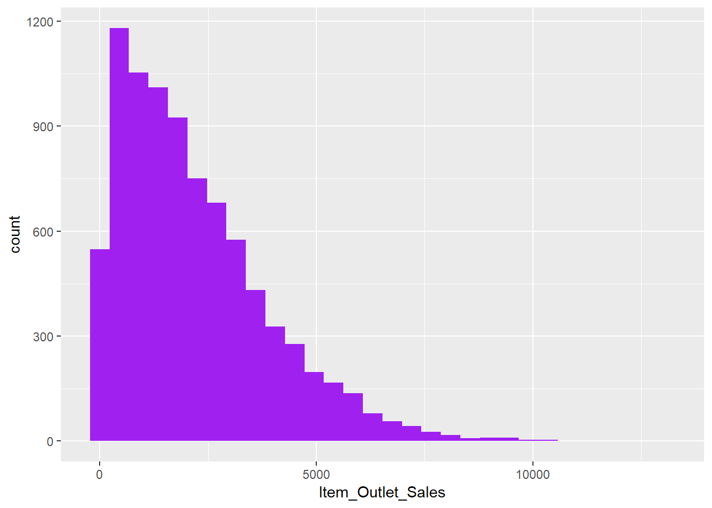
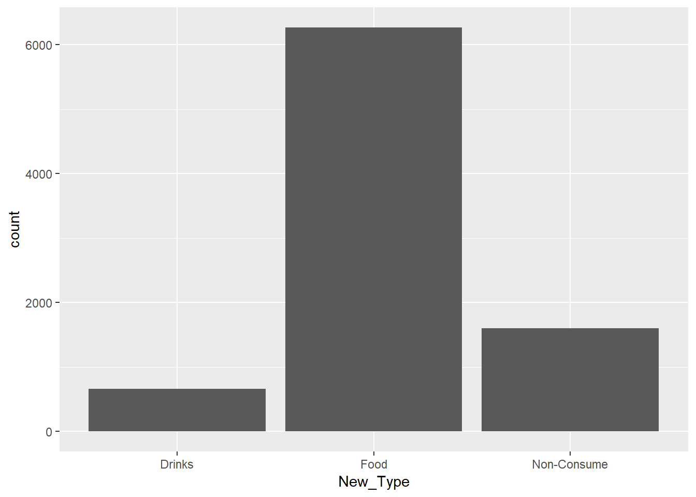
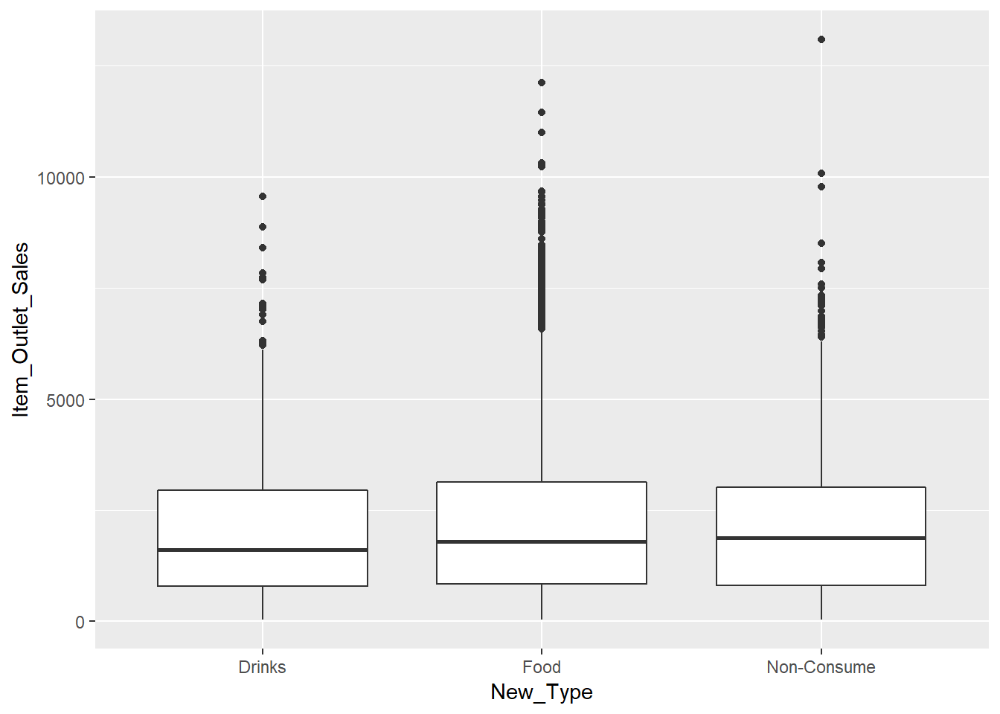
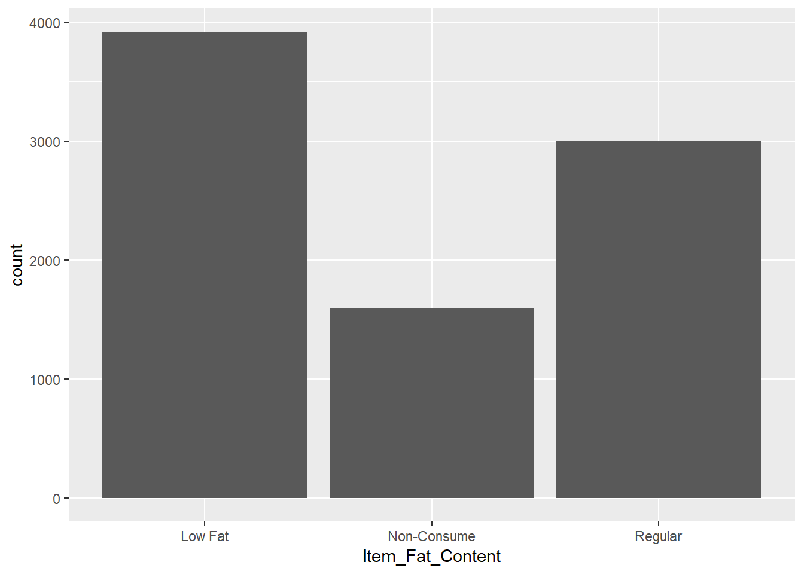
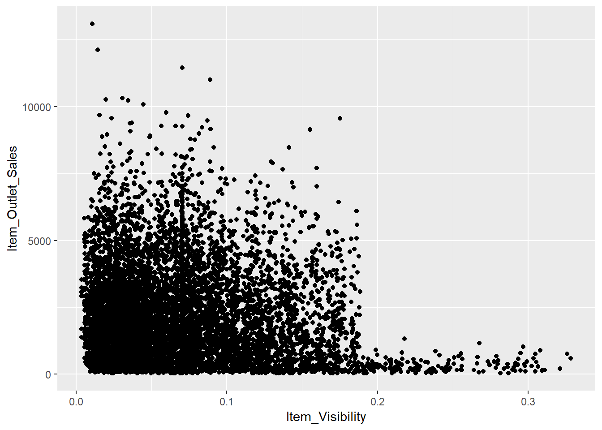
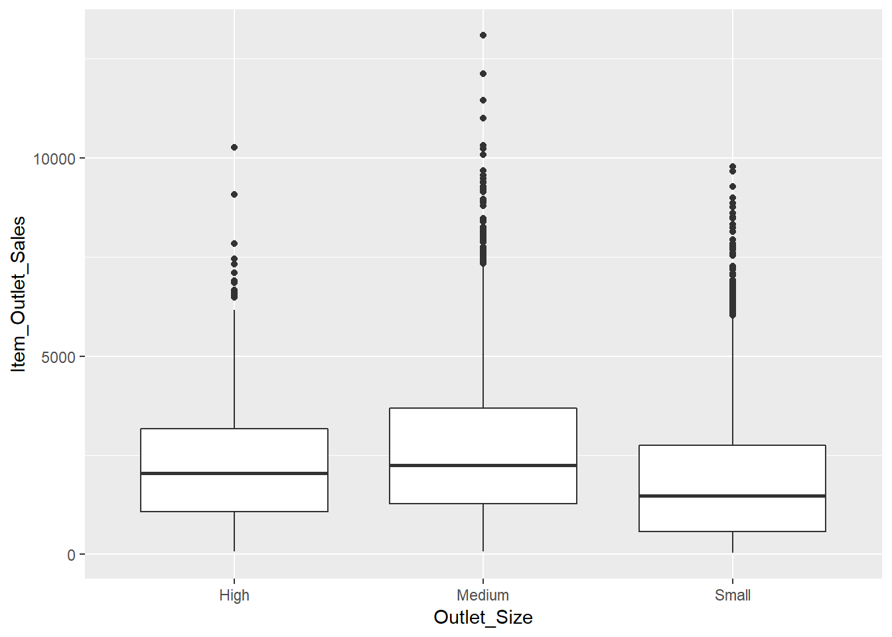
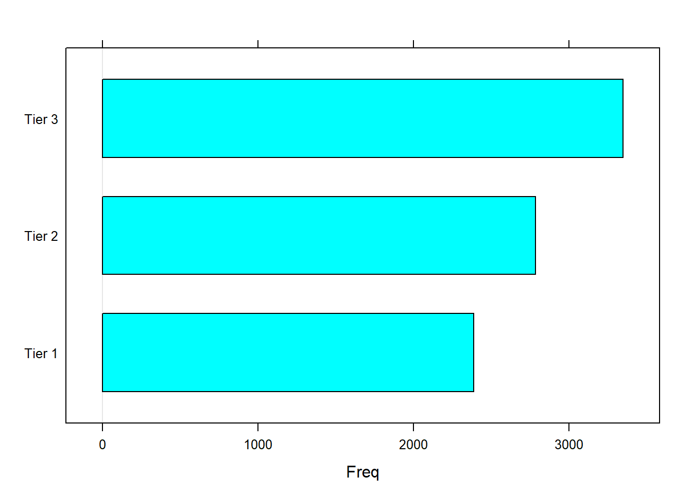
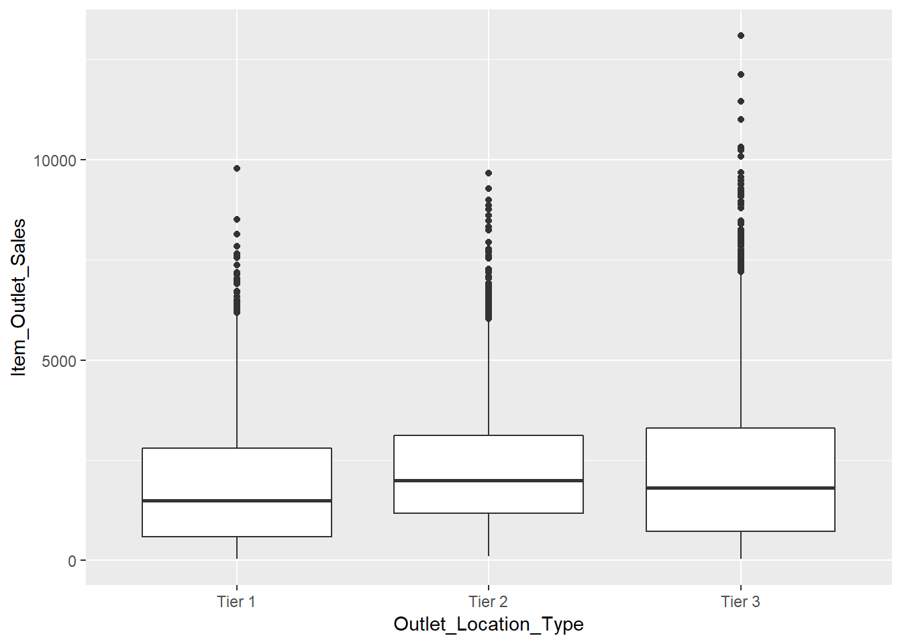
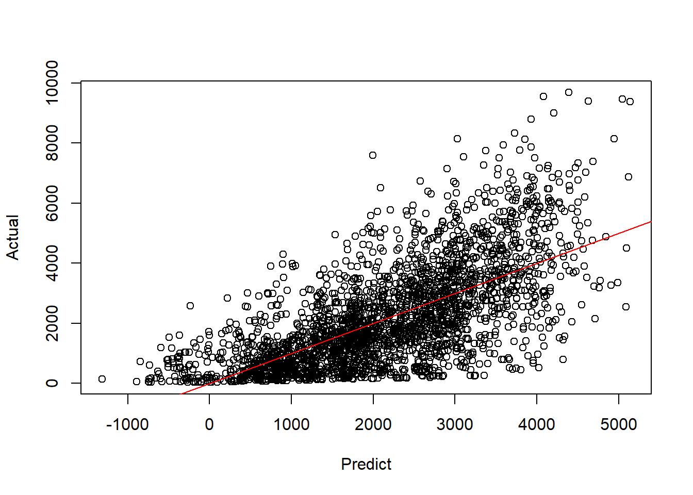

<!-- README.md is generated from README.Rmd. Please edit that file -->

Supervised Learning Project: Iris Classification
================================================

The data scientists at BigMart have collected 2013 sales data for 1559 products across 10 stores in different cities. Also, certain attributes of each product and store have been defined. The aim is to build a predictive model and find out the sales of each product at a particular store.

Using this model, BigMart will try to understand the properties of products and stores which play a key role in increasing sales.

Please note that some of the data may have missing values as some stores might not report all the data due to technical glitches. Hence, this will be treated accordingly to ensure the best outcome possible. Here are the variables in the data set:

-   Item\_Identifier: Unique product ID
-   Item\_Weight: Weight of product
-   Item\_Fat\_Content: Whether the product is low fat or not
-   Item\_Visibility: The % of total display area of all products in a store allocated to the particular product
-   Item\_Type: The category to which the product belongs
-   Item\_MRP: Maximum Retail Price (list price) of the product
-   Outlet\_Identifier: Unique store ID
-   Outlet\_Establishment\_Year: The year in which store was established
-   Outlet\_Size: The size of the store in terms of ground area covered
-   Outlet\_Location\_Type: The type of city in which the store is located
-   Outlet\_Type: Whether the outlet is just a grocery store or some sort of supermarket
-   Item\_Outlet\_Sales: Sales of the product in the particulat store. This is the outcome variable to be predicted.

The variables are mainly from 2 category, the item itself or the features of the outlet. From these variables, we are able to come up with hypothesis to understand relationship between the input variables and target variable.

1.  Food type of item would have higher sales.
2.  Low fat has better sales because customers prefer low fat than regular.
3.  Items which are more visible has higher sales.
4.  The bigger the size of the outlet would have higher sales.
5.  Outlets in areas with higher income would have higher sales.

Load Packages and Data
----------------------

In this section, we will load all the necessary packages for this project.

``` r
#Import Packages
library(tidyverse)
library(caret)
library(party)
library(randomForest)
library(VIM)
library(mice)
library(psych)
library(MASS)
library(Metrics)
library(dplyr)
library(rpart)

#load Data
df <- read.csv("~/Programming/R/3 - Projects/Project 13 - Bigmart/Data/Train_UWu5bXk.txt")

#First six rows on the data set
head(df)
##   Item_Identifier Item_Weight Item_Fat_Content Item_Visibility
## 1           FDA15       9.300          Low Fat      0.01604730
## 2           DRC01       5.920          Regular      0.01927822
## 3           FDN15      17.500          Low Fat      0.01676007
## 4           FDX07      19.200          Regular      0.00000000
## 5           NCD19       8.930          Low Fat      0.00000000
## 6           FDP36      10.395          Regular      0.00000000
##               Item_Type Item_MRP Outlet_Identifier
## 1                 Dairy 249.8092            OUT049
## 2           Soft Drinks  48.2692            OUT018
## 3                  Meat 141.6180            OUT049
## 4 Fruits and Vegetables 182.0950            OUT010
## 5             Household  53.8614            OUT013
## 6          Baking Goods  51.4008            OUT018
##   Outlet_Establishment_Year Outlet_Size Outlet_Location_Type
## 1                      1999      Medium               Tier 1
## 2                      2009      Medium               Tier 3
## 3                      1999      Medium               Tier 1
## 4                      1998                           Tier 3
## 5                      1987        High               Tier 3
## 6                      2009      Medium               Tier 3
##         Outlet_Type Item_Outlet_Sales
## 1 Supermarket Type1         3735.1380
## 2 Supermarket Type2          443.4228
## 3 Supermarket Type1         2097.2700
## 4     Grocery Store          732.3800
## 5 Supermarket Type1          994.7052
## 6 Supermarket Type2          556.6088
```

Data Exploration
----------------

During this stage, we will investigate the data set even futher to have a better understanding of the data.

``` r
#To see the shape of the data
glimpse(df)
## Observations: 8,523
## Variables: 12
## $ Item_Identifier           <fct> FDA15, DRC01, FDN15, FDX07, NCD19, F...
## $ Item_Weight               <dbl> 9.300, 5.920, 17.500, 19.200, 8.930,...
## $ Item_Fat_Content          <fct> Low Fat, Regular, Low Fat, Regular, ...
## $ Item_Visibility           <dbl> 0.016047301, 0.019278216, 0.01676007...
## $ Item_Type                 <fct> Dairy, Soft Drinks, Meat, Fruits and...
## $ Item_MRP                  <dbl> 249.8092, 48.2692, 141.6180, 182.095...
## $ Outlet_Identifier         <fct> OUT049, OUT018, OUT049, OUT010, OUT0...
## $ Outlet_Establishment_Year <int> 1999, 2009, 1999, 1998, 1987, 2009, ...
## $ Outlet_Size               <fct> Medium, Medium, Medium, , High, Medi...
## $ Outlet_Location_Type      <fct> Tier 1, Tier 3, Tier 1, Tier 3, Tier...
## $ Outlet_Type               <fct> Supermarket Type1, Supermarket Type2...
## $ Item_Outlet_Sales         <dbl> 3735.1380, 443.4228, 2097.2700, 732....
```

There is a total of 8,523 observations and 12 variables in the data set. There are 6 categorical variables, 4 number variables and 1 date vairable.

``` r
#Have a look at the summary statistics of input variables
summary(df)
##  Item_Identifier  Item_Weight     Item_Fat_Content Item_Visibility  
##  FDG33  :  10    Min.   : 4.555   LF     : 316     Min.   :0.00000  
##  FDW13  :  10    1st Qu.: 8.774   low fat: 112     1st Qu.:0.02699  
##  DRE49  :   9    Median :12.600   Low Fat:5089     Median :0.05393  
##  DRN47  :   9    Mean   :12.858   reg    : 117     Mean   :0.06613  
##  FDD38  :   9    3rd Qu.:16.850   Regular:2889     3rd Qu.:0.09459  
##  FDF52  :   9    Max.   :21.350                    Max.   :0.32839  
##  (Other):8467    NA's   :1463                                       
##                  Item_Type       Item_MRP      Outlet_Identifier
##  Fruits and Vegetables:1232   Min.   : 31.29   OUT027 : 935     
##  Snack Foods          :1200   1st Qu.: 93.83   OUT013 : 932     
##  Household            : 910   Median :143.01   OUT035 : 930     
##  Frozen Foods         : 856   Mean   :140.99   OUT046 : 930     
##  Dairy                : 682   3rd Qu.:185.64   OUT049 : 930     
##  Canned               : 649   Max.   :266.89   OUT045 : 929     
##  (Other)              :2994                    (Other):2937     
##  Outlet_Establishment_Year Outlet_Size   Outlet_Location_Type
##  Min.   :1985                    :2410   Tier 1:2388         
##  1st Qu.:1987              High  : 932   Tier 2:2785         
##  Median :1999              Medium:2793   Tier 3:3350         
##  Mean   :1998              Small :2388                       
##  3rd Qu.:2004                                                
##  Max.   :2009                                                
##                                                              
##             Outlet_Type   Item_Outlet_Sales 
##  Grocery Store    :1083   Min.   :   33.29  
##  Supermarket Type1:5577   1st Qu.:  834.25  
##  Supermarket Type2: 928   Median : 1794.33  
##  Supermarket Type3: 935   Mean   : 2181.29  
##                           3rd Qu.: 3101.30  
##                           Max.   :13086.97  
## 
```

From the summary we can see that some of the variables require transformation such as Item\_Fat\_Content because it has the same meaning between different category. Item\_Type has 16 different category and requires to be narrowed down to be able to use for the modelling phase later. We can see some missing data and also a category missing in Outlet\_Size. We can also see the summary statistics for the target variable.

Data Visualization
------------------

Data Visualization helps us see how the target variable react with the input variables

### Outlet Sales

``` r
#Histogram
ggplot(df,aes(x=Item_Outlet_Sales))+
  geom_histogram(fill='purple',bins = 30)
```



In the histogram we can see that most of the sales is on the left side of the histogram. This is expected because histogram involving spending does usually has this type of histogram.

### Item Type

Since there 16 types, we are going to transform into 3 main values which are Food, Drinks and Non-Consume.

``` r
df$New_Type <- ifelse(df$Item_Type %in% c('Soft Drinks','Hard Drinks'),'Drinks',ifelse(df$Item_Type %in% c('Health and Hygiene','Household','Others'),'Non-Consume','Food'))

df$New_Type <- as.factor(df$New_Type)

ggplot(df,aes(x=New_Type))+
  geom_bar()
```



After the transformation, we have created a bar plot and it is obvious that Food has the most count.

``` r
ggplot(df,aes(x=New_Type,y=Item_Outlet_Sales))+
  geom_boxplot()
```



From the boxplot, we can see that the Drinks' median is lower than both Food and Non-Consume.

### Fat Content

Previously, we have seen that the values in this column are the same and requires transformation.

``` r
df$Item_Fat_Content <-ifelse(df$Item_Fat_Content %in% c('reg','Regular'),'Regular','Low Fat')
df$Item_Fat_Content <-ifelse(df$New_Type%in%'Non-Consume','Non-Consume',df$Item_Fat_Content)
df$Item_Fat_Content <- as.factor(df$Item_Fat_Content)

ggplot(df,aes(x=Item_Fat_Content))+
  geom_bar()
```



From the bar chart, we can see that Low Fat has the most counts compared to the other two.

``` r
a = ggplot(df,aes(x=Item_Fat_Content,y=Item_Outlet_Sales))+
  geom_boxplot()
```

From the boxplot,we can see that the median for all three values are quite similar which means that this variable doesn't have a huge impact on the sales of the outlet.

### Item Visibility

Some of values in this variable is 0 but that does not make any sense therefore we are going to consider this as missing value and impute it with the mean.

``` r
df$Item_Visibility[df$Item_Visibility==0]<-NA
df$Item_Visibility[is.na(df$Item_Visibility)] = mean(df$Item_Visibility, na.rm=TRUE)
```

From the bar chart, we can see that Low Fat has the most counts compared to the other two.

``` r
ggplot(df,aes(x=Item_Visibility,y=Item_Outlet_Sales))+
  geom_point()
```



From the scatterplot, we can see that there is no relationship between the two variables.

### Outlet Size

Outlet size seems to be missing a value and this would be a problem if we do not change it now.

``` r
table(df$Outlet_Type,df$Outlet_Size)
##                    
##                          High Medium Small
##   Grocery Store      555    0      0   528
##   Supermarket Type1 1855  932    930  1860
##   Supermarket Type2    0    0    928     0
##   Supermarket Type3    0    0    935     0
```

Looking at the table, is it quite obvious that the missing value is in the small due to its similarity of outlet type breakdown.

``` r
df$Outlet_Size[df$Outlet_Size %in%  ''] <- 'Small'
df$Outlet_Size <- as.factor(df$Outlet_Size)
ggplot(df,aes(x=Outlet_Size,y=Item_Outlet_Sales))+
  geom_boxplot()
```



From the boxplot,it is clear smaller outlet has lower sales but medium outlets have a higher median than the rest.

### Outlet Location

The outlets have 3 main location type with all different income groups.

``` r
barchart(df$Outlet_Location_Type)
```

 We can see that Bigmart has the most outlets in tier 3 locations followed by tier 2 and 1.

``` r
ggplot(df,aes(x=Outlet_Location_Type,y=Item_Outlet_Sales))+
  geom_boxplot()
```



From the boxplot,we can see that tier 2 locations have the highest sales followed by tier 3 then tier 1. This indicates that Bigmart customers are mainly from tier 2 locations.

Data splitting
--------------

Before training a machine learning model, it is crucial to split the data set into two groups so that we are able to test out model. The data is split into training and testing data. The training data consist of 70% of the data set.

``` r
#data split
new_data = df%>% dplyr::select(-Item_Identifier,-Outlet_Identifier)
trainIndex = createDataPartition(new_data$Item_Outlet_Sales,p=0.7,times=1,list=F)
training = new_data[trainIndex,]
testing = new_data[-trainIndex,]
```

Data Modelling
--------------

For data modelling, we will take the training data and use logistic regression and decision tree to create the model.

``` r
model_lm1 <-lm(Item_Outlet_Sales ~+Item_Visibility + Item_MRP + Outlet_Establishment_Year + Outlet_Size + Outlet_Location_Type,data=training)
summary(model_lm1)

tree_1 <- rpart(Item_Outlet_Sales~.,data=training)
summary(tree_1)
```

Model Evaluation
----------------

Once we have done the modelling, we will use mean squared error(MSE) to evaluate both models. Model with the lowest MSE is the best performing model.

``` r
predict_1 <- predict(model_lm1,testing)
mse(predict_1,testing$Item_Outlet_Sales)
## [1] 1560162
plot(predict_1,testing$Item_Outlet_Sales,xlab="Predict",ylab='Actual')
abline(a=0,b=1,col='red')
```



Logistic regression has an MSE of 1622357 and from the plot we can see how the model performs.

``` r
tree_22 <- predict(tree_1,testing)
mse(tree_22,testing$Item_Outlet_Sales)
## [1] 1209840
```

Decision tree has an MSE of 1.209839710^{6}.

Summary
-------

From the model, we can conclude that some variables are more important than others in predicting the sales of each outlet. This is crucial for Bigmart to understand as the model might change if they decide to operate different.
