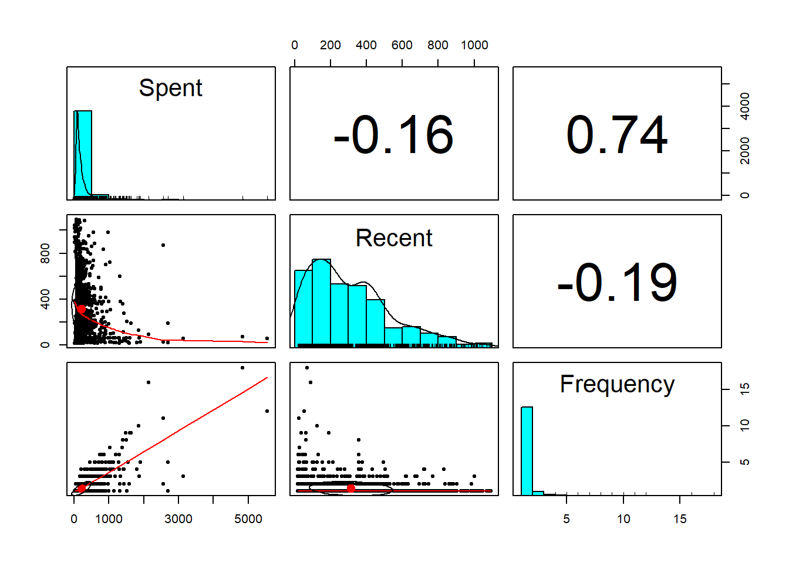
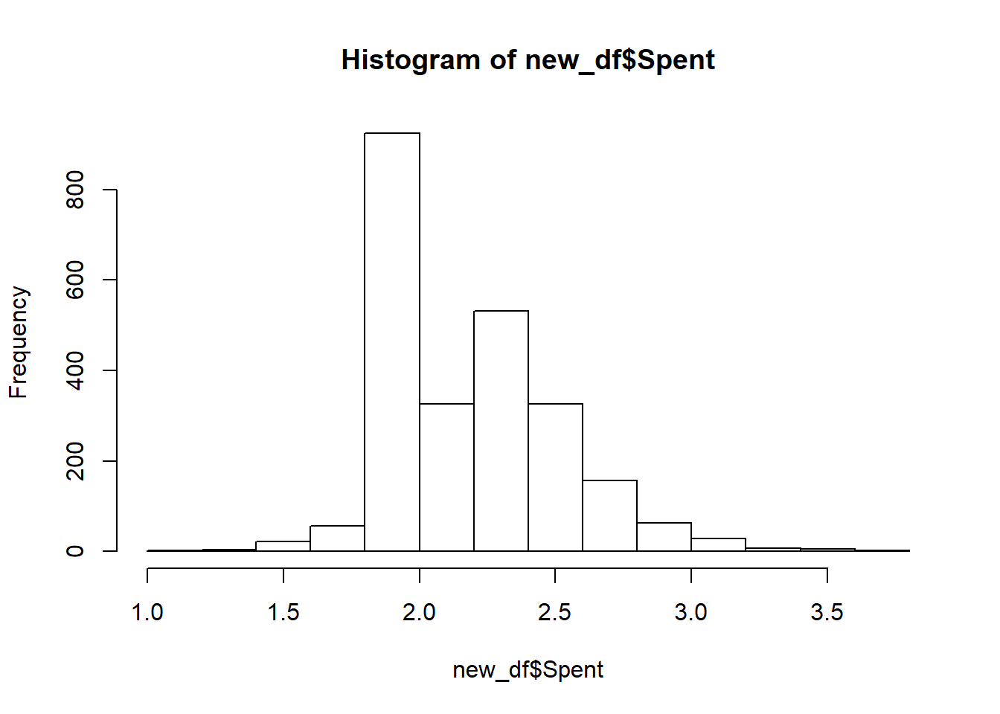
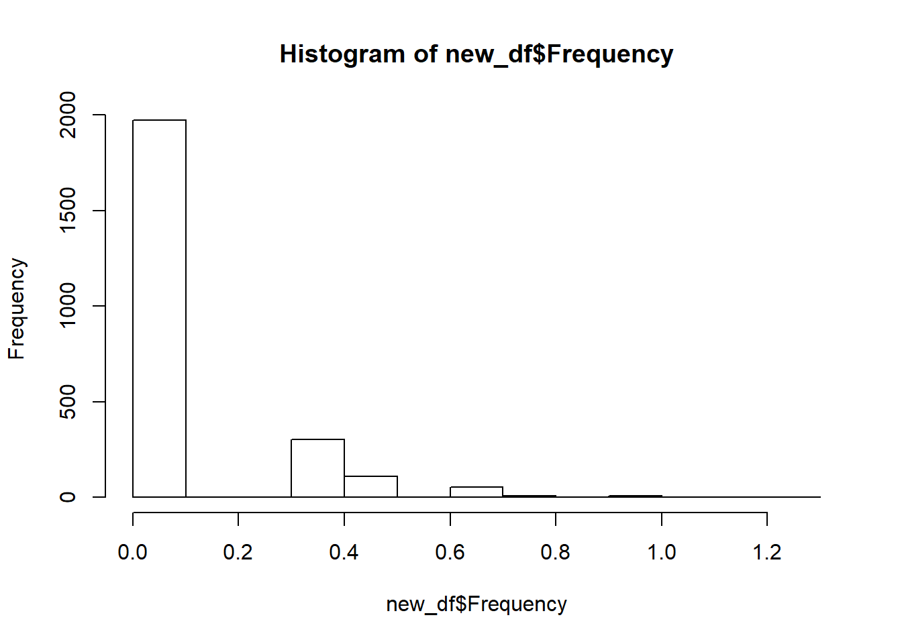
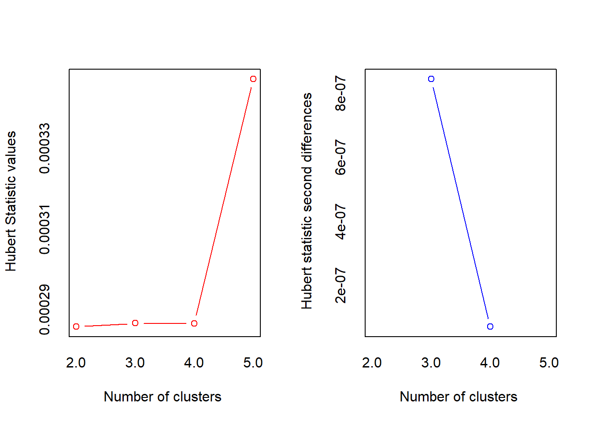
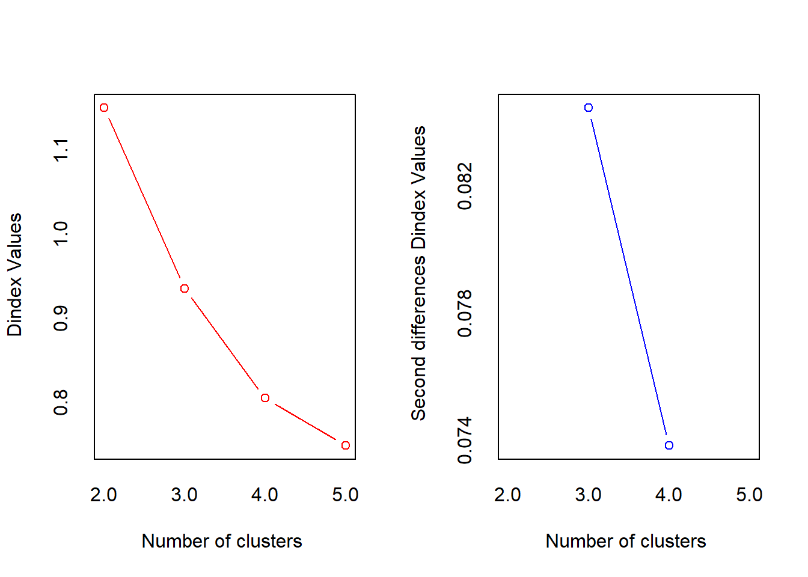
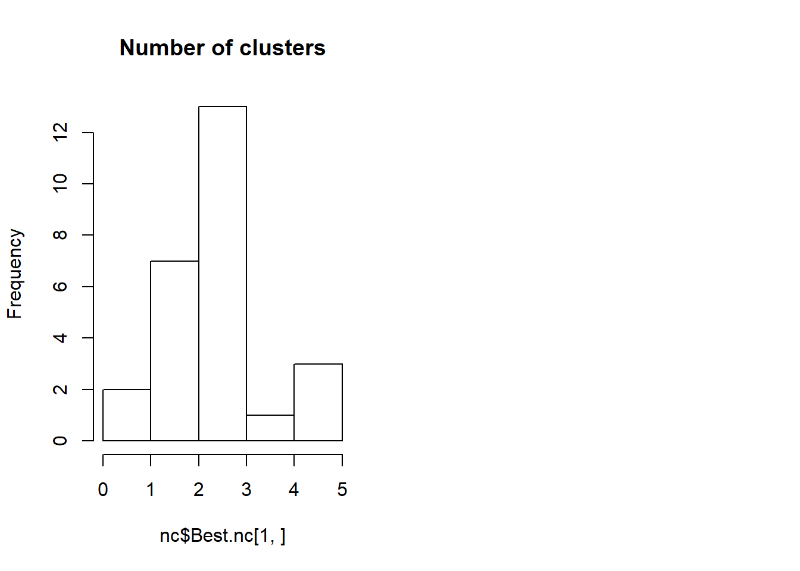
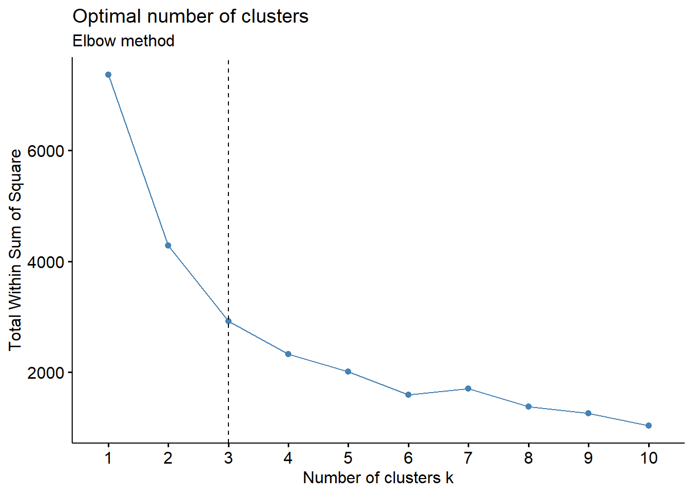
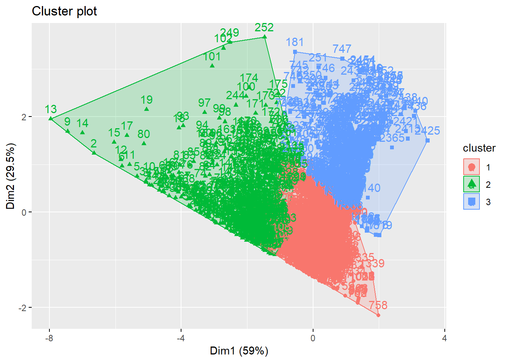
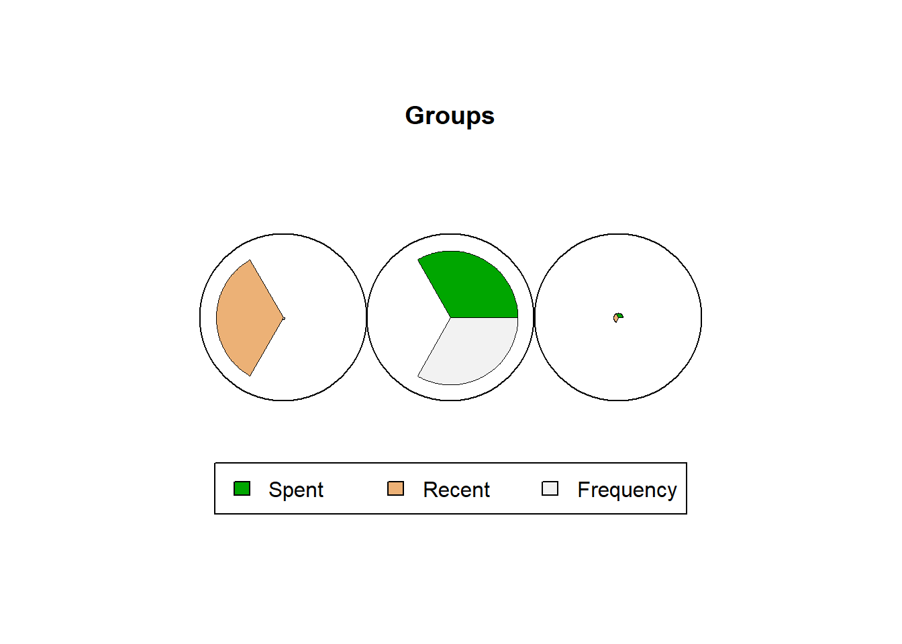
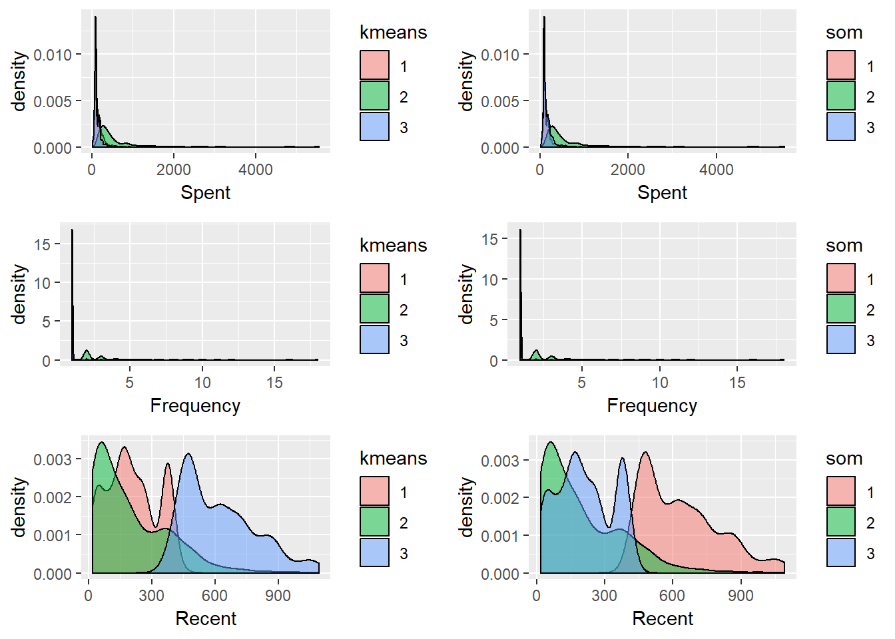

<!-- README.md is generated from README.Rmd. Please edit that file -->
Customer Segementation
======================

ZAA sells Islamic women clothing and have been in business roughly five years. They mainly sell their products online and have various line of products. ZAA wants to be able to communicate to their customers more efficently therefore they have decided to segment their customers.

For this problem, we are going to group their customers using k-means technique based on their buying behaviour. From the data set, they have provided a lof of different data but we only the put data that has been cleaned. The following are the variables:

-   Customer ID: Unique customer ID
-   Spent: Total amount a customer spent
-   Recent: Number of days from last purchase
-   Frequency: Number of times customers shop

Load Packages and Data
----------------------

In this section, we will load all the necessary packages for this project. For this project, k-means packages are used for clustering.

``` r
#Import necessary packages for the project
library(readxl)
library(tidyverse)
library(cluster)
library(psych)
library(NbClust)
library(e1071)
library(factoextra)
library(kohonen)
library(ggpubr)

#Load data set
df <- read_excel("~/Programming/R/3 - Projects/Project 17 - Customer Clustering/zacustomer.xlsx")
#First six rows on the data set
head(df)
## # A tibble: 6 x 4
##   `Customer ID` Spent Recent Frequency
##   <chr>         <dbl>  <dbl>     <dbl>
## 1 ZAA001        1198      22         6
## 2 ZAA002        2556.     25        11
## 3 ZAA003        1032      26         7
## 4 ZAA004         778      27         6
## 5 ZAA005        1389      29         7
## 6 ZAA006        1485.     38         9
```

Data Exploration
----------------

During this stage, we will investigate the data set even futher to have a better understanding of the data.

For this project, there is a total of 2455 observations and four variables.

``` r
#To see the shape of the data
glimpse(df)
## Observations: 2,455
## Variables: 4
## $ `Customer ID` <chr> "ZAA001", "ZAA002", "ZAA003", "ZAA004", "ZAA005"...
## $ Spent         <dbl> 1198.00, 2555.60, 1032.00, 778.00, 1389.00, 1485...
## $ Recent        <dbl> 22, 25, 26, 27, 29, 38, 45, 50, 55, 60, 64, 64, ...
## $ Frequency     <dbl> 6, 11, 7, 6, 7, 9, 6, 6, 12, 6, 8, 9, 18, 16, 10...
summary(df)
##  Customer ID            Spent            Recent         Frequency     
##  Length:2455        Min.   :  14.0   Min.   :  18.0   Min.   : 1.000  
##  Class :character   1st Qu.:  90.0   1st Qu.: 134.0   1st Qu.: 1.000  
##  Mode  :character   Median : 139.0   Median : 259.0   Median : 1.000  
##                     Mean   : 217.3   Mean   : 313.5   Mean   : 1.343  
##                     3rd Qu.: 240.5   3rd Qu.: 445.5   3rd Qu.: 1.000  
##                     Max.   :5550.1   Max.   :1092.0   Max.   :18.000
```

From the summary, we can see that both Spent and Frequency is likely to be skewed. We will visualize this in the later part.

``` r
#convert columns into factors
new_df <- select(df,-`Customer ID`)
```

We dropped the Customer ID as this will not provide any value towards our clustering.

Data Visualization
------------------

In this section, we can visualize the data to look for useful insight.

``` r
#Credit hisotry and loan status
pairs.panels(new_df)
```



From the pairs panel, we can see both Spent and Frequency is quite skewed and this might require us to transform the data.

Transformation
--------------

``` r
new_df$Spent <- log10(new_df$Spent)
hist(new_df$Spent)
```



``` r
skewness(new_df$Spent)
## [1] 0.8474038

new_df$Frequency <- log10(new_df$Frequency)
hist(new_df$Frequency)
```



``` r
skewness(new_df$Frequency)
## [1] 2.352699
```

We have used log10 to transform the data to make it less skewed. We can see from the histogram that both variable have improved to be able to use later.

Normalization
-------------

In this phase, we will normalize the data. This is to ensure clustering is done without one variable dominating due to huge numbers.

``` r
#normalization
normdf <- scale(new_df)
summary(normdf)
##      Spent             Recent          Frequency      
##  Min.   :-3.3527   Min.   :-1.2674   Min.   :-0.4532  
##  1st Qu.:-0.7709   1st Qu.:-0.7699   1st Qu.:-0.4532  
##  Median :-0.1678   Median :-0.2338   Median :-0.4532  
##  Mean   : 0.0000   Mean   : 0.0000   Mean   : 0.0000  
##  3rd Qu.: 0.5929   3rd Qu.: 0.5661   3rd Qu.:-0.4532  
##  Max.   : 4.9482   Max.   : 3.3389   Max.   : 6.7553
```

Number of Clusters
------------------

In this phase, we will determine how many clusters are recommended on several methods.

``` r
#calculate euclidiean distance
nc <- NbClust(normdf, min.nc=2, max.nc=5, method="kmeans")
```



    ## *** : The Hubert index is a graphical method of determining the number of clusters.
    ##                 In the plot of Hubert index, we seek a significant knee that corresponds to a 
    ##                 significant increase of the value of the measure i.e the significant peak in Hubert
    ##                 index second differences plot. 
    ## 



    ## *** : The D index is a graphical method of determining the number of clusters. 
    ##                 In the plot of D index, we seek a significant knee (the significant peak in Dindex
    ##                 second differences plot) that corresponds to a significant increase of the value of
    ##                 the measure. 
    ##  
    ## ******************************************************************* 
    ## * Among all indices:                                                
    ## * 7 proposed 2 as the best number of clusters 
    ## * 13 proposed 3 as the best number of clusters 
    ## * 1 proposed 4 as the best number of clusters 
    ## * 3 proposed 5 as the best number of clusters 
    ## 
    ##                    ***** Conclusion *****                            
    ##  
    ## * According to the majority rule, the best number of clusters is  3 
    ##  
    ##  
    ## *******************************************************************
    hist(nc$Best.nc[1,],main = 'Number of clusters')



From the histogram,we can see that 3 clusters have been recommended the most.

``` r
fviz_nbclust(normdf,kmeans,method='wss')+
    geom_vline(xintercept = 3, linetype = 2)+
    labs(subtitle = "Elbow method")
```



Here we use the elbow method to see how many clusters is recommended. From our observation, we can conclude that 3 clusters is the best for this project.

Segmentation
------------

Segmentation using kmeans and visualization to show the grouping.

``` r
kc <- kmeans(normdf,3)
kc$centers
##        Spent     Recent  Frequency
## 1 -0.2123591 -0.4490252 -0.4454692
## 2  1.2765874 -0.4974339  1.8370102
## 3 -0.4948585  1.3173129 -0.4163027
```

Here shows the normalised centres for each clusters. We can see that only Spent has marginal different between the 3 clusters. The other 2 variables, the distance is not so huge between certain clusters.

``` r
fviz_cluster(kc,data=normdf)
```



From the plot, we can see the three different groups based on the dimesions.

``` r
somclus <- som(normdf, grid = somgrid(3, 1, "hexagonal"))
plot(somclus,main = "Groups")
```



This is using the kohonen segmentation. In the chart we can see how the 3 groups are segmented based on the variables. One group is full with people who spent a lot and buys frequently but has not bought recently. The other group is full with customers who bought recently and the last group is from customers who has spent less compared to the others.

Insight And Visualisation
-------------------------

We will see on the spending habit of each cluster. Which cluster spends the most and frequently buy from ZAA. This will help the company to identify high spending customers.

``` r
df$kmeans <- as.factor(kc$cluster)
df$som <- as.factor(somclus$unit.classif)
```

Here we put the clusters from both technique in the dataset.

### Density plot

``` r
p1 <- ggplot(df,aes(x=Spent,fill=kmeans))+
  geom_density(alpha=0.5)

p2 <- ggplot(df,aes(x=Frequency,fill=kmeans))+
  geom_density(alpha=0.5)

p3 <- ggplot(df,aes(x=Recent,fill=kmeans))+
  geom_density(alpha=0.5)

p4 <- ggplot(df,aes(x=Spent,fill=som))+
  geom_density(alpha=0.5)

p5 <- ggplot(df,aes(x=Frequency,fill=som))+
  geom_density(alpha=0.5)

p6 <- ggplot(df,aes(x=Recent,fill=som))+
  geom_density(alpha=0.5)


ggarrange(p1,p4,p2,p5,p3,p6, ncol = 2, nrow = 3)
```



From all the density plot we can see how each segmentation group the customers. Both technique is quite similar in their segementation. From the kmeans, we can conclude cluster 1 is great group for ZAA to focus on as they spent the most and frequently buy from the company.

Summary
-------

Although 2 techniques have been used for the segmentation, we can see that both clustering are quite similar. Group 1 should be considered has great customer due to their buying habits.Group 2 are recent customers but have not buying a lot so ZAA has to stategise on how they can move people from group 2 to group 1.
