<!-- README.md is generated from README.Rmd. Please edit that file -->

Loan Eligibility Predictive Model
=================================

A company wants to automate the loan eligibility process (real time) based on customer detail provided while filling online application form. These details are Gender, Marital Status, Education, Number of Dependents, Income, Loan Amount, Credit History and others. To automate this process, they have given a problem to identify the customers segments, those are eligible for loan amount so that they can specifically target these customers. Here are the variables in the data set:

-   Variable: Description
-   Loan\_ID: Unique Loan ID
-   Gender: Male/ Female
-   Married: Applicant married (Y/N)
-   Dependents: Number of dependents
-   Education: Applicant Education (Graduate/ Under Graduate)
-   Self\_Employed: Self employed (Y/N)
-   ApplicantIncome: Applicant income
-   CoapplicantIncome: Coapplicant income
-   LoanAmount: Loan amount in thousands
-   Loan\_Amount\_Term: Term of loan in months
-   Credit\_History: credit history meets guidelines
-   Property\_Area: Urban/ Semi Urban/ Rural
-   Loan\_Status: Loan approved (Y/N)

Load Packages and Data
----------------------

In this section, we will load all the necessary packages for this project.

``` r
#Import necessary packages for the project
library(readr)
library(caret)
library(tidyverse)
library(psych)
library(party)
library(randomForest)
library(mice)
library(VIM)
library(e1071)

#Load data set
df <- read_csv("~/Programming/Dataset/CSV/loan/train_ctrUa4K.csv")

#First six rows on the data set
head(df)
## # A tibble: 6 x 13
##   Loan_ID Gender Married Dependents Education Self_Employed ApplicantIncome
##   <chr>   <chr>  <chr>   <chr>      <chr>     <chr>                   <dbl>
## 1 LP0010~ Male   No      0          Graduate  No                       5849
## 2 LP0010~ Male   Yes     1          Graduate  No                       4583
## 3 LP0010~ Male   Yes     0          Graduate  Yes                      3000
## 4 LP0010~ Male   Yes     0          Not Grad~ No                       2583
## 5 LP0010~ Male   No      0          Graduate  No                       6000
## 6 LP0010~ Male   Yes     2          Graduate  Yes                      5417
## # ... with 6 more variables: CoapplicantIncome <dbl>, LoanAmount <dbl>,
## #   Loan_Amount_Term <dbl>, Credit_History <dbl>, Property_Area <chr>,
## #   Loan_Status <chr>
```

Data Exploration
----------------

During this stage, we will investigate the data set even futher to have a better understanding of the data.

For this project, there is a total of 614 observations and 13 variables.

``` r
#To see the shape of the data
glimpse(df)
## Observations: 614
## Variables: 13
## $ Loan_ID           <chr> "LP001002", "LP001003", "LP001005", "LP00100...
## $ Gender            <chr> "Male", "Male", "Male", "Male", "Male", "Mal...
## $ Married           <chr> "No", "Yes", "Yes", "Yes", "No", "Yes", "Yes...
## $ Dependents        <chr> "0", "1", "0", "0", "0", "2", "0", "3+", "2"...
## $ Education         <chr> "Graduate", "Graduate", "Graduate", "Not Gra...
## $ Self_Employed     <chr> "No", "No", "Yes", "No", "No", "Yes", "No", ...
## $ ApplicantIncome   <dbl> 5849, 4583, 3000, 2583, 6000, 5417, 2333, 30...
## $ CoapplicantIncome <dbl> 0, 1508, 0, 2358, 0, 4196, 1516, 2504, 1526,...
## $ LoanAmount        <dbl> NA, 128, 66, 120, 141, 267, 95, 158, 168, 34...
## $ Loan_Amount_Term  <dbl> 360, 360, 360, 360, 360, 360, 360, 360, 360,...
## $ Credit_History    <dbl> 1, 1, 1, 1, 1, 1, 1, 0, 1, 1, 1, 1, 1, 1, 1,...
## $ Property_Area     <chr> "Urban", "Rural", "Urban", "Urban", "Urban",...
## $ Loan_Status       <chr> "Y", "N", "Y", "Y", "Y", "Y", "Y", "N", "Y",...
summary(df)
##    Loan_ID             Gender            Married         
##  Length:614         Length:614         Length:614        
##  Class :character   Class :character   Class :character  
##  Mode  :character   Mode  :character   Mode  :character  
##                                                          
##                                                          
##                                                          
##                                                          
##   Dependents         Education         Self_Employed      ApplicantIncome
##  Length:614         Length:614         Length:614         Min.   :  150  
##  Class :character   Class :character   Class :character   1st Qu.: 2878  
##  Mode  :character   Mode  :character   Mode  :character   Median : 3812  
##                                                           Mean   : 5403  
##                                                           3rd Qu.: 5795  
##                                                           Max.   :81000  
##                                                                          
##  CoapplicantIncome   LoanAmount    Loan_Amount_Term Credit_History  
##  Min.   :    0     Min.   :  9.0   Min.   : 12      Min.   :0.0000  
##  1st Qu.:    0     1st Qu.:100.0   1st Qu.:360      1st Qu.:1.0000  
##  Median : 1188     Median :128.0   Median :360      Median :1.0000  
##  Mean   : 1621     Mean   :146.4   Mean   :342      Mean   :0.8422  
##  3rd Qu.: 2297     3rd Qu.:168.0   3rd Qu.:360      3rd Qu.:1.0000  
##  Max.   :41667     Max.   :700.0   Max.   :480      Max.   :1.0000  
##                    NA's   :22      NA's   :14       NA's   :50      
##  Property_Area      Loan_Status       
##  Length:614         Length:614        
##  Class :character   Class :character  
##  Mode  :character   Mode  :character  
##                                       
##                                       
##                                       
## 
```

Most of the variables are characters and needs to transform them into categorical data.

``` r
#convert columns into factors
cols = c('Gender','Married','Dependents','Education','Self_Employed','Credit_History','Property_Area','Loan_Status','Loan_Amount_Term')
df[cols] = lapply(df[cols], factor)
```

### Data Visualization

In this section, we can visualize the data to look for useful insight.

``` r
#Credit hisotry and loan status
ggplot(df,aes(x=Credit_History,fill=Loan_Status))+
  geom_bar()
```

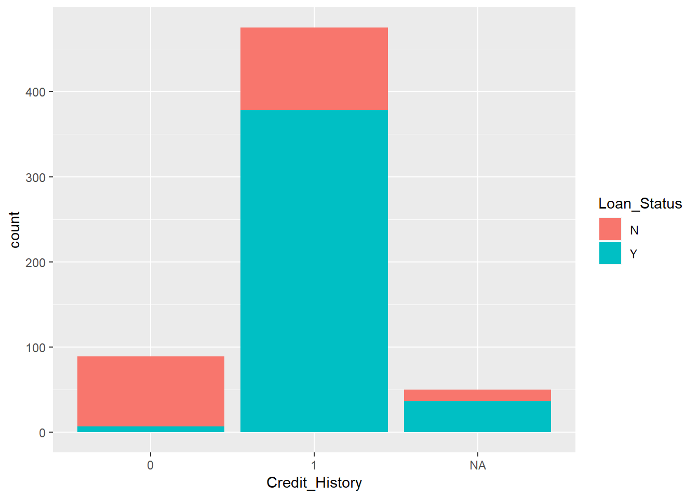

From this plot, it is quite obvious that an applicant with a credit history has a higher probability of getting a loan.

``` r
ggplot(df,aes(x=Property_Area,fill=Loan_Status))+
  geom_bar()
```

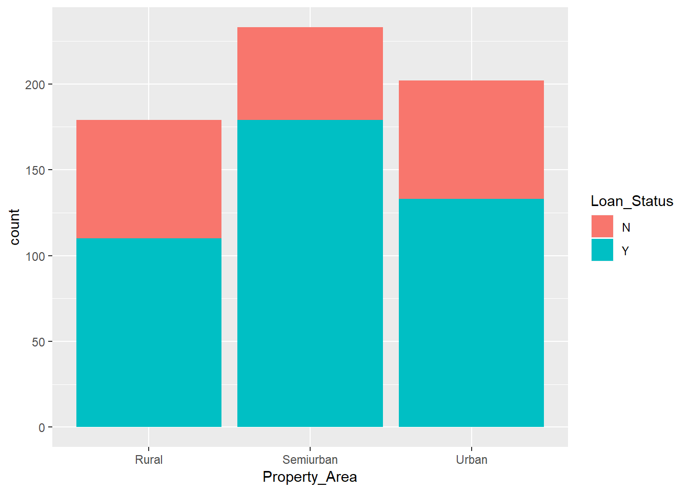

We can also that applicants living in a semi urban area has a better chance of getting their loans approved.

We can also get similar results in different variable such as married and education.

``` r
#Loan Amount histogram
ggplot(df,aes(x=LoanAmount))+
  geom_histogram(fill='purple',bins = 50)
## Warning: Removed 22 rows containing non-finite values (stat_bin).
```

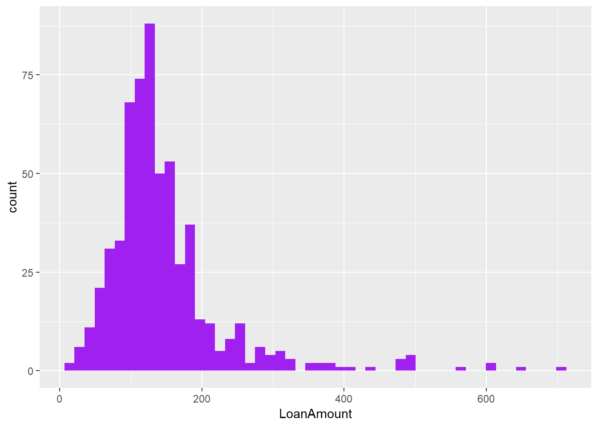

``` r

ggplot(df,aes(y=LoanAmount))+
  geom_boxplot()
## Warning: Removed 22 rows containing non-finite values (stat_boxplot).
```

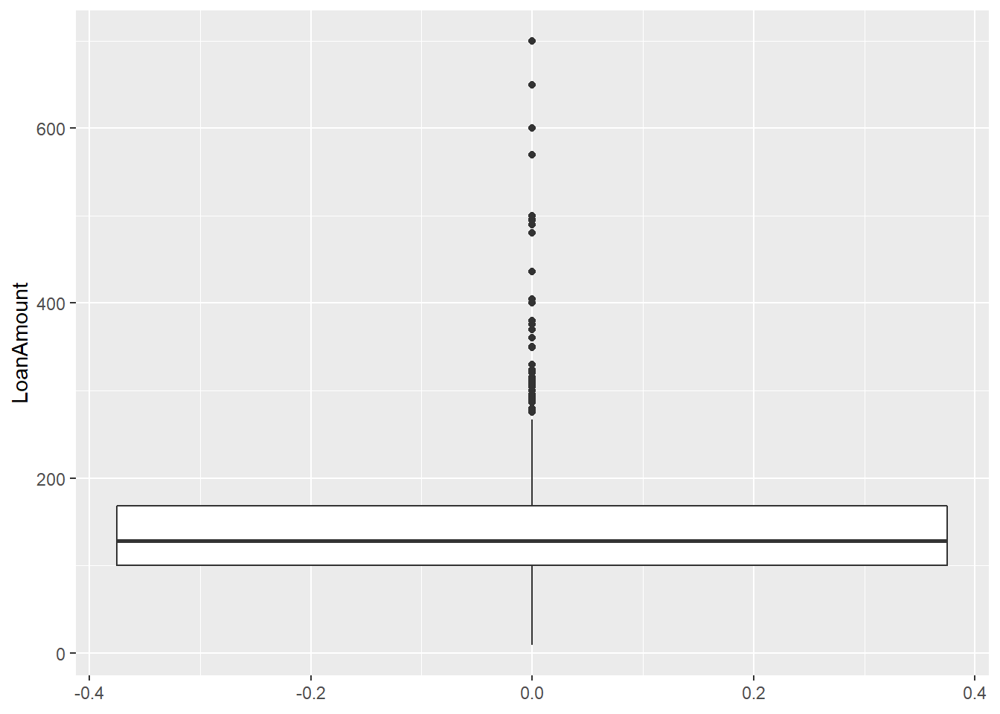

``` r

ggplot(df,aes(y=LoanAmount,x=df$Education))+
  geom_boxplot()
## Warning: Removed 22 rows containing non-finite values (stat_boxplot).
```

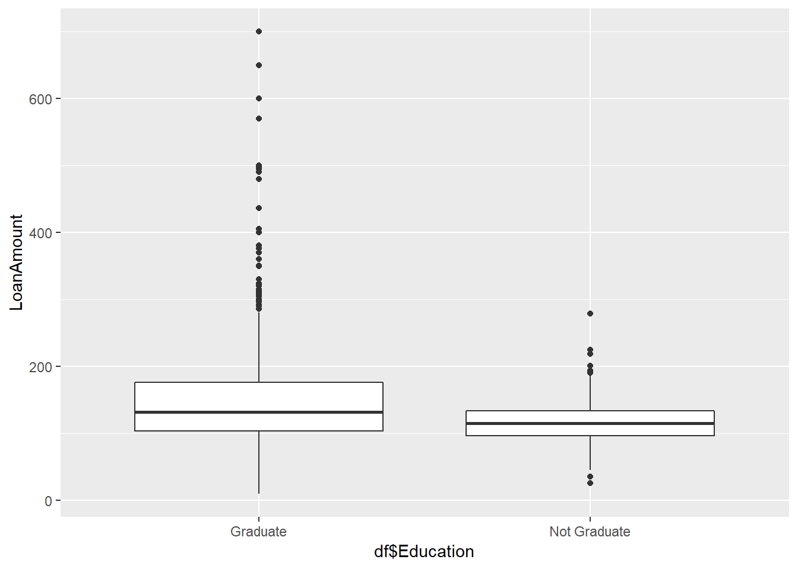

We can see from both the histogram and boxplot that LoanAmount has extreme values and requires transformation.

``` r
ggplot(df,aes(x=ApplicantIncome,fill=Loan_Status))+
  geom_histogram(fill='purple',bins=50)
```

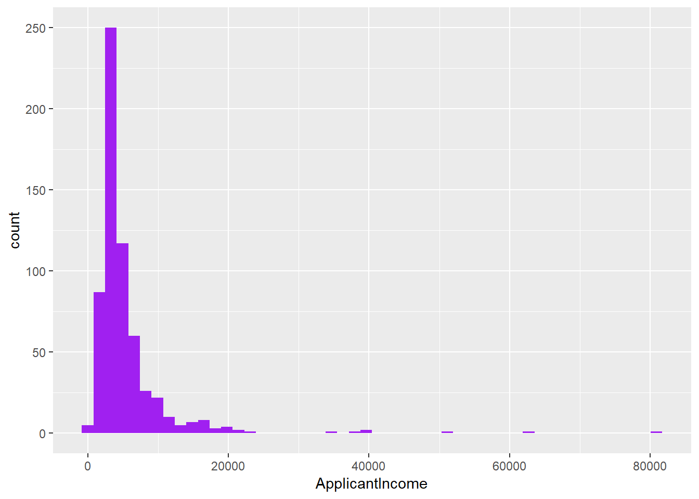

``` r

ggplot(df,aes(y=ApplicantIncome))+
  geom_boxplot()
```

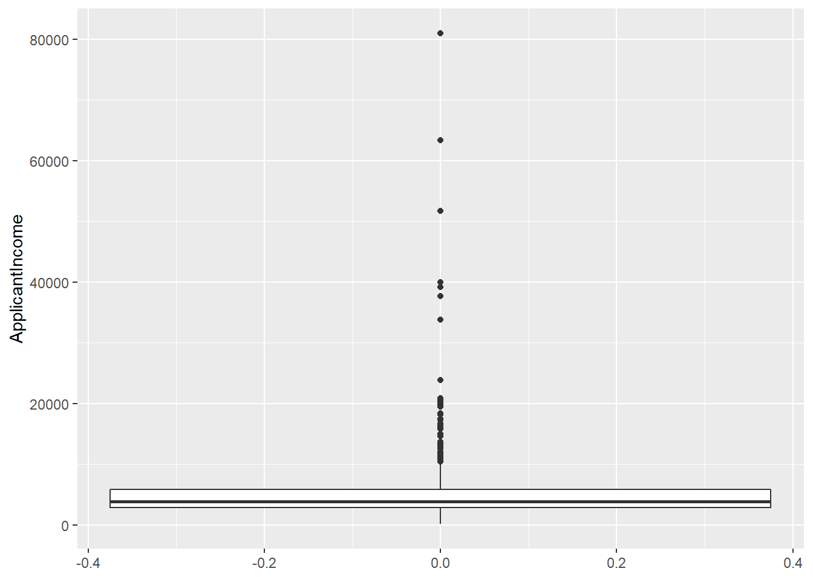

ApplicantIncome also has some extreme values as can be seen in both histrogram and boxplot.

Data Transformation
-------------------

We will transform both ApplicantIncome and LoanAmount using log due to their skewness.

``` r
df$LoanAmount <- log1p(df$LoanAmount)
df$ApplicantIncome <- log1p(df$ApplicantIncome)

ggplot(df,aes(x=ApplicantIncome))+
  geom_histogram(fill='purple',bins=50)
```

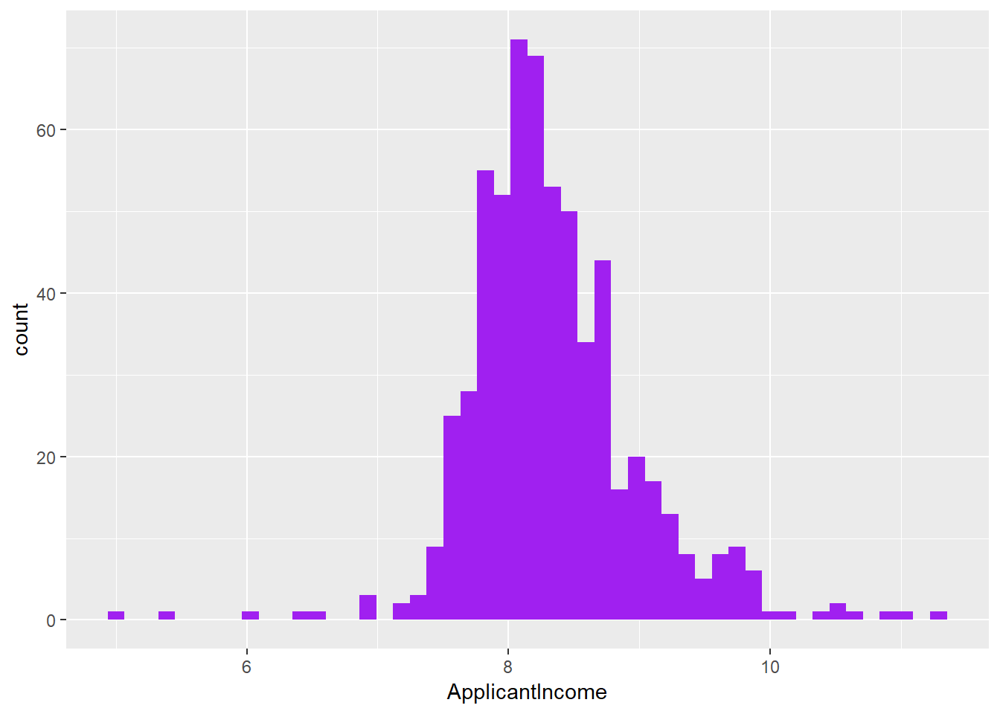

``` r

ggplot(df,aes(x=LoanAmount))+
  geom_histogram(fill='purple',bins=50)
## Warning: Removed 22 rows containing non-finite values (stat_bin).
```

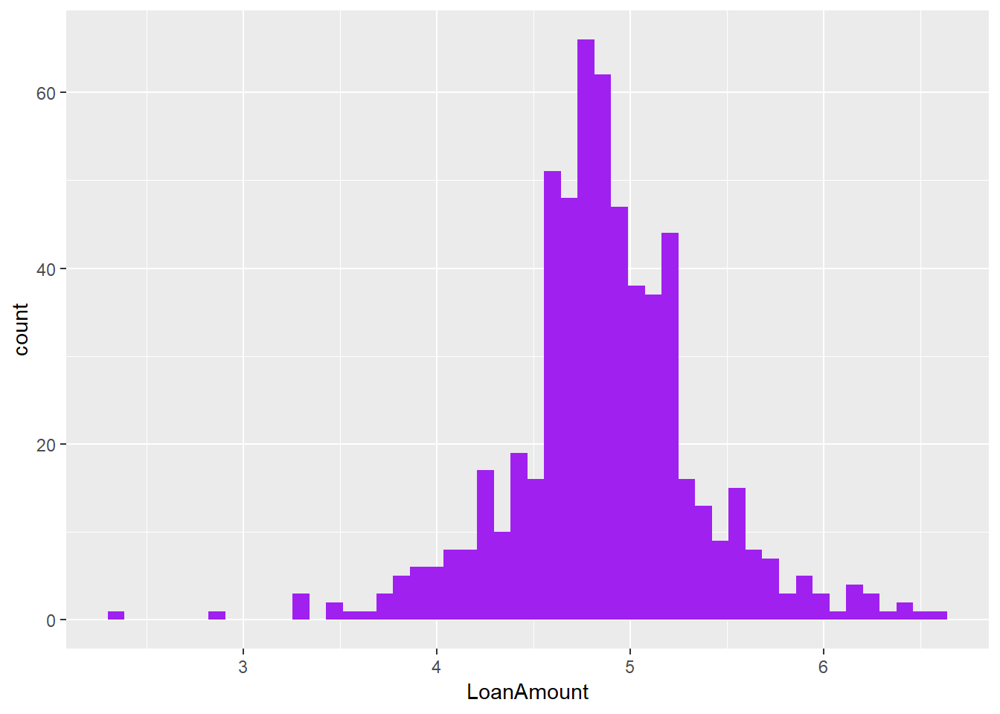

We can see from the new histogram that both are no longer skewed and this would help the model to perform better in the later phase of this project.

Missing Values
--------------

From our earlier exploration, we have found out that there are some missing values in the data set.

``` r
#Missing data for each column
colSums(is.na(df))
##           Loan_ID            Gender           Married        Dependents 
##                 0                13                 3                15 
##         Education     Self_Employed   ApplicantIncome CoapplicantIncome 
##                 0                32                 0                 0 
##        LoanAmount  Loan_Amount_Term    Credit_History     Property_Area 
##                22                14                50                 0 
##       Loan_Status 
##                 0
```

From here we can see total of missing data from each variable. Credit\_History has the most with 50 and Self\_Employed with 32 missing data.

``` r
md.pattern(df)
```

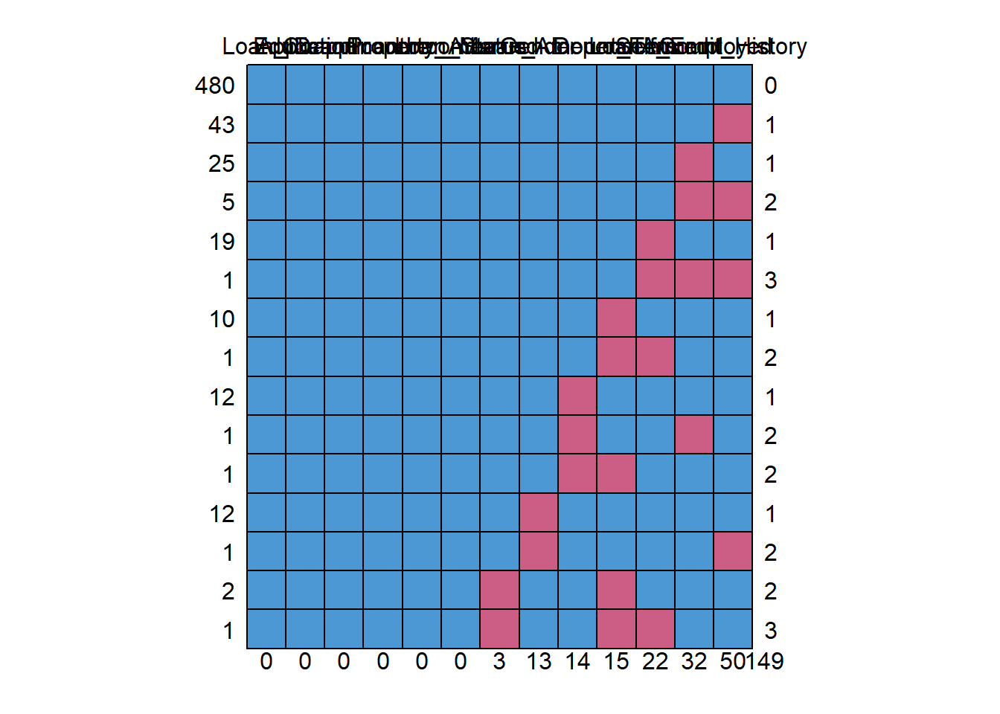

    ##     Loan_ID Education ApplicantIncome CoapplicantIncome Property_Area
    ## 480       1         1               1                 1             1
    ## 43        1         1               1                 1             1
    ## 25        1         1               1                 1             1
    ## 5         1         1               1                 1             1
    ## 19        1         1               1                 1             1
    ## 1         1         1               1                 1             1
    ## 10        1         1               1                 1             1
    ## 1         1         1               1                 1             1
    ## 12        1         1               1                 1             1
    ## 1         1         1               1                 1             1
    ## 1         1         1               1                 1             1
    ## 12        1         1               1                 1             1
    ## 1         1         1               1                 1             1
    ## 2         1         1               1                 1             1
    ## 1         1         1               1                 1             1
    ##           0         0               0                 0             0
    ##     Loan_Status Married Gender Loan_Amount_Term Dependents LoanAmount
    ## 480           1       1      1                1          1          1
    ## 43            1       1      1                1          1          1
    ## 25            1       1      1                1          1          1
    ## 5             1       1      1                1          1          1
    ## 19            1       1      1                1          1          0
    ## 1             1       1      1                1          1          0
    ## 10            1       1      1                1          0          1
    ## 1             1       1      1                1          0          0
    ## 12            1       1      1                0          1          1
    ## 1             1       1      1                0          1          1
    ## 1             1       1      1                0          0          1
    ## 12            1       1      0                1          1          1
    ## 1             1       1      0                1          1          1
    ## 2             1       0      1                1          0          1
    ## 1             1       0      1                1          0          0
    ##               0       3     13               14         15         22
    ##     Self_Employed Credit_History    
    ## 480             1              1   0
    ## 43              1              0   1
    ## 25              0              1   1
    ## 5               0              0   2
    ## 19              1              1   1
    ## 1               0              0   3
    ## 10              1              1   1
    ## 1               1              1   2
    ## 12              1              1   1
    ## 1               0              1   2
    ## 1               1              1   2
    ## 12              1              1   1
    ## 1               1              0   2
    ## 2               1              1   2
    ## 1               1              1   3
    ##                32             50 149

Here we can see that 480 observations have no missing values in all the columns. We can see 43 observations has missing values only in Credit\_History,25 has missing values only in Self\_Employed and so on.

To make things easier, it is best to visualize the missing values to understand them better.

``` r
#Missing data visualize
aggr(df,numbers=TRUE,prop=c(TRUE,TRUE),cex.axis=0.5)
```

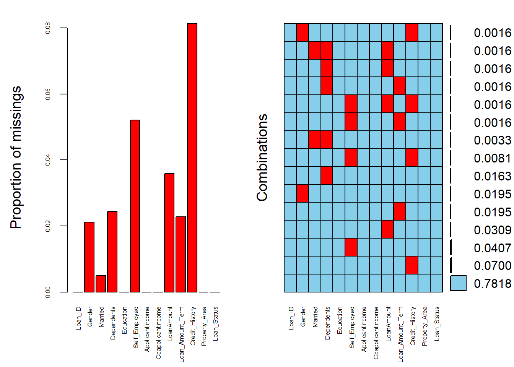

From the plot, we can see that the variables with the highest amount of missing value is Credit\_History with 8% and the second highest is Self\_Employed with 5%. On the combinations plot, we can see the different combination of missing values.

Data Imputing
-------------

For the missing values, we have to impute the data to ensure for them modelling phase. We will use the mice package to do so. m = 5 refers to to the number of imputed dataset,pmm referst to preditive mean matching as the method and maxit is the number of iterations.

``` r
imputed_Data <- mice(df, m=5, maxit = 10, method = 'pmm', seed = 500)
## 
##  iter imp variable
##   1   1  Gender  Married  Dependents  Self_Employed  LoanAmount  Loan_Amount_Term  Credit_History
##   1   2  Gender  Married  Dependents  Self_Employed  LoanAmount  Loan_Amount_Term  Credit_History
##   1   3  Gender  Married  Dependents  Self_Employed  LoanAmount  Loan_Amount_Term  Credit_History
##   1   4  Gender  Married  Dependents  Self_Employed  LoanAmount  Loan_Amount_Term  Credit_History
##   1   5  Gender  Married  Dependents  Self_Employed  LoanAmount  Loan_Amount_Term  Credit_History
##   2   1  Gender  Married  Dependents  Self_Employed  LoanAmount  Loan_Amount_Term  Credit_History
##   2   2  Gender  Married  Dependents  Self_Employed  LoanAmount  Loan_Amount_Term  Credit_History
##   2   3  Gender  Married  Dependents  Self_Employed  LoanAmount  Loan_Amount_Term  Credit_History
##   2   4  Gender  Married  Dependents  Self_Employed  LoanAmount  Loan_Amount_Term  Credit_History
##   2   5  Gender  Married  Dependents  Self_Employed  LoanAmount  Loan_Amount_Term  Credit_History
##   3   1  Gender  Married  Dependents  Self_Employed  LoanAmount  Loan_Amount_Term  Credit_History
##   3   2  Gender  Married  Dependents  Self_Employed  LoanAmount  Loan_Amount_Term  Credit_History
##   3   3  Gender  Married  Dependents  Self_Employed  LoanAmount  Loan_Amount_Term  Credit_History
##   3   4  Gender  Married  Dependents  Self_Employed  LoanAmount  Loan_Amount_Term  Credit_History
##   3   5  Gender  Married  Dependents  Self_Employed  LoanAmount  Loan_Amount_Term  Credit_History
##   4   1  Gender  Married  Dependents  Self_Employed  LoanAmount  Loan_Amount_Term  Credit_History
##   4   2  Gender  Married  Dependents  Self_Employed  LoanAmount  Loan_Amount_Term  Credit_History
##   4   3  Gender  Married  Dependents  Self_Employed  LoanAmount  Loan_Amount_Term  Credit_History
##   4   4  Gender  Married  Dependents  Self_Employed  LoanAmount  Loan_Amount_Term  Credit_History
##   4   5  Gender  Married  Dependents  Self_Employed  LoanAmount  Loan_Amount_Term  Credit_History
##   5   1  Gender  Married  Dependents  Self_Employed  LoanAmount  Loan_Amount_Term  Credit_History
##   5   2  Gender  Married  Dependents  Self_Employed  LoanAmount  Loan_Amount_Term  Credit_History
##   5   3  Gender  Married  Dependents  Self_Employed  LoanAmount  Loan_Amount_Term  Credit_History
##   5   4  Gender  Married  Dependents  Self_Employed  LoanAmount  Loan_Amount_Term  Credit_History
##   5   5  Gender  Married  Dependents  Self_Employed  LoanAmount  Loan_Amount_Term  Credit_History
##   6   1  Gender  Married  Dependents  Self_Employed  LoanAmount  Loan_Amount_Term  Credit_History
##   6   2  Gender  Married  Dependents  Self_Employed  LoanAmount  Loan_Amount_Term  Credit_History
##   6   3  Gender  Married  Dependents  Self_Employed  LoanAmount  Loan_Amount_Term  Credit_History
##   6   4  Gender  Married  Dependents  Self_Employed  LoanAmount  Loan_Amount_Term  Credit_History
##   6   5  Gender  Married  Dependents  Self_Employed  LoanAmount  Loan_Amount_Term  Credit_History
##   7   1  Gender  Married  Dependents  Self_Employed  LoanAmount  Loan_Amount_Term  Credit_History
##   7   2  Gender  Married  Dependents  Self_Employed  LoanAmount  Loan_Amount_Term  Credit_History
##   7   3  Gender  Married  Dependents  Self_Employed  LoanAmount  Loan_Amount_Term  Credit_History
##   7   4  Gender  Married  Dependents  Self_Employed  LoanAmount  Loan_Amount_Term  Credit_History
##   7   5  Gender  Married  Dependents  Self_Employed  LoanAmount  Loan_Amount_Term  Credit_History
##   8   1  Gender  Married  Dependents  Self_Employed  LoanAmount  Loan_Amount_Term  Credit_History
##   8   2  Gender  Married  Dependents  Self_Employed  LoanAmount  Loan_Amount_Term  Credit_History
##   8   3  Gender  Married  Dependents  Self_Employed  LoanAmount  Loan_Amount_Term  Credit_History
##   8   4  Gender  Married  Dependents  Self_Employed  LoanAmount  Loan_Amount_Term  Credit_History
##   8   5  Gender  Married  Dependents  Self_Employed  LoanAmount  Loan_Amount_Term  Credit_History
##   9   1  Gender  Married  Dependents  Self_Employed  LoanAmount  Loan_Amount_Term  Credit_History
##   9   2  Gender  Married  Dependents  Self_Employed  LoanAmount  Loan_Amount_Term  Credit_History
##   9   3  Gender  Married  Dependents  Self_Employed  LoanAmount  Loan_Amount_Term  Credit_History
##   9   4  Gender  Married  Dependents  Self_Employed  LoanAmount  Loan_Amount_Term  Credit_History
##   9   5  Gender  Married  Dependents  Self_Employed  LoanAmount  Loan_Amount_Term  Credit_History
##   10   1  Gender  Married  Dependents  Self_Employed  LoanAmount  Loan_Amount_Term  Credit_History
##   10   2  Gender  Married  Dependents  Self_Employed  LoanAmount  Loan_Amount_Term  Credit_History
##   10   3  Gender  Married  Dependents  Self_Employed  LoanAmount  Loan_Amount_Term  Credit_History
##   10   4  Gender  Married  Dependents  Self_Employed  LoanAmount  Loan_Amount_Term  Credit_History
##   10   5  Gender  Married  Dependents  Self_Employed  LoanAmount  Loan_Amount_Term  Credit_History
## Warning: Number of logged events: 51
summary(imputed_Data)
## Class: mids
## Number of multiple imputations:  5 
## Imputation methods:
##           Loan_ID            Gender           Married        Dependents 
##                ""             "pmm"             "pmm"             "pmm" 
##         Education     Self_Employed   ApplicantIncome CoapplicantIncome 
##                ""             "pmm"                ""                "" 
##        LoanAmount  Loan_Amount_Term    Credit_History     Property_Area 
##             "pmm"             "pmm"             "pmm"                "" 
##       Loan_Status 
##                "" 
## PredictorMatrix:
##               Loan_ID Gender Married Dependents Education Self_Employed
## Loan_ID             0      1       1          1         1             1
## Gender              0      0       1          1         1             1
## Married             0      1       0          1         1             1
## Dependents          0      1       1          0         1             1
## Education           0      1       1          1         0             1
## Self_Employed       0      1       1          1         1             0
##               ApplicantIncome CoapplicantIncome LoanAmount
## Loan_ID                     1                 1          1
## Gender                      1                 1          1
## Married                     1                 1          1
## Dependents                  1                 1          1
## Education                   1                 1          1
## Self_Employed               1                 1          1
##               Loan_Amount_Term Credit_History Property_Area Loan_Status
## Loan_ID                      1              1             1           1
## Gender                       1              1             1           1
## Married                      1              1             1           1
## Dependents                   1              1             1           1
## Education                    1              1             1           1
## Self_Employed                1              1             1           1
## Number of logged events:  51 
##   it im            dep     meth                 out
## 1  0  0                constant             Loan_ID
## 2  1  1 Credit_History      pmm Loan_Amount_Term360
## 3  1  2 Credit_History      pmm Loan_Amount_Term360
## 4  1  3 Credit_History      pmm Loan_Amount_Term360
## 5  1  4 Credit_History      pmm Loan_Amount_Term360
## 6  1  5 Credit_History      pmm Loan_Amount_Term360

completeData <- complete(imputed_Data,2)

#Change positive into Y
completeData$Loan_Status <- ifelse(completeData$Loan_Status == 'Y',1,0)

#Change target variable into factor
completeData$Loan_Status <- as.factor(completeData$Loan_Status)
```

``` r
skewness(completeData$LoanAmount)
## [1] -0.1144072
skewness(completeData$ApplicantIncome)
## [1] 0.4797749
```

Data splitting
--------------

Before training a machine learning model, it is crucial to split the data set into two groups so that we are able to test out model. We will use the newly imputed data set for the modelling. The data is split into training and testing data. The training data consist of 70% of the data set. The Loan\_ID will be remove for the modelling phase as it is only a unique number for each applicantion.

``` r
#splitting
new_df <- dplyr::select(completeData,-Loan_ID)
trainIndex <- createDataPartition(new_df$Loan_Status,p=0.7,times=1,list=F)
training <- new_df[trainIndex,]
testing <- new_df[-trainIndex,]
```

Data Modelling
--------------

For data modelling, we will take the training data and use decision tree, random forest and logistic regression to create the model.

``` r
#modelling
tree_train <- ctree(Loan_Status~.,data=training)
plot(tree_train)
```

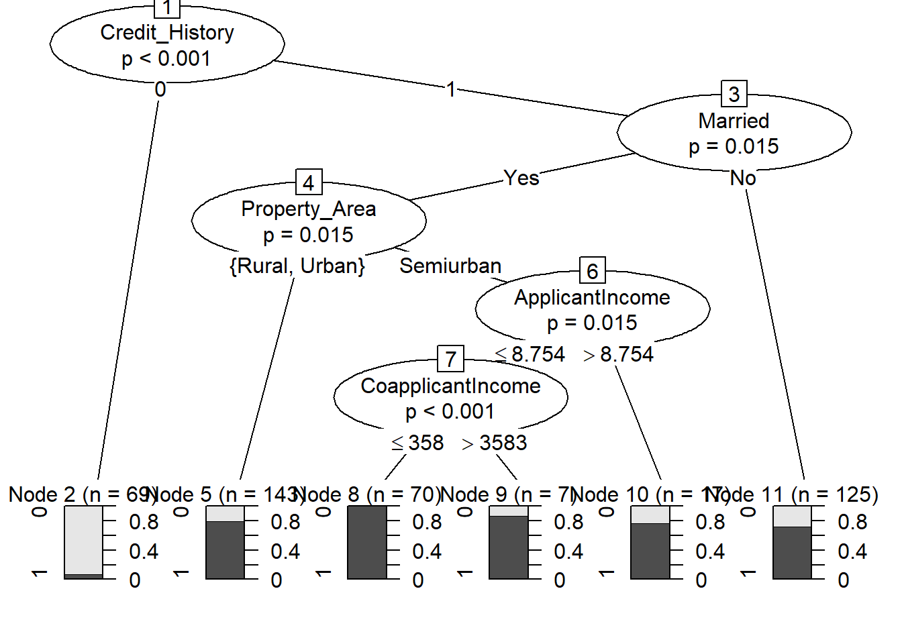

``` r
rf <- randomForest(Loan_Status~.,data=training)
varImpPlot(rf)
```

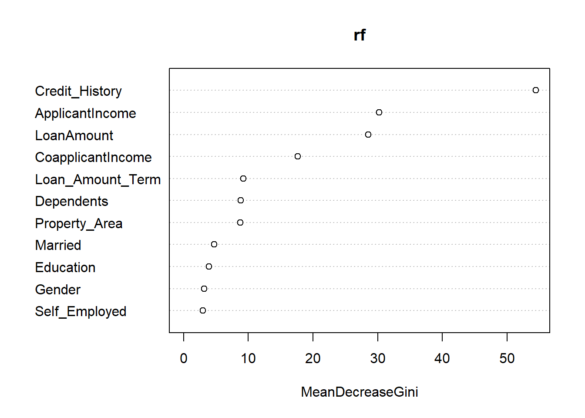

Using varImpPlot we can see the importance of each variable by using the random forest model. Credit\_History is the most important and followed by others according to the plot.

``` r
glm_model <- glm(Loan_Status~.,data=training,family=binomial)
summary(glm_model)
## 
## Call:
## glm(formula = Loan_Status ~ ., family = binomial, data = training)
## 
## Deviance Residuals: 
##     Min       1Q   Median       3Q      Max  
## -2.4059  -0.2646   0.4219   0.6877   2.7369  
## 
## Coefficients:
##                          Estimate Std. Error z value Pr(>|z|)    
## (Intercept)             1.288e+01  2.400e+03   0.005 0.995718    
## GenderMale              1.312e-01  3.731e-01   0.352 0.725170    
## MarriedYes              5.320e-01  3.228e-01   1.648 0.099338 .  
## Dependents1            -5.068e-01  3.741e-01  -1.355 0.175566    
## Dependents2             9.839e-01  5.026e-01   1.958 0.050268 .  
## Dependents3+            1.906e-01  5.141e-01   0.371 0.710751    
## EducationNot Graduate  -4.082e-01  3.361e-01  -1.214 0.224606    
## Self_EmployedYes       -2.032e-01  4.292e-01  -0.473 0.635971    
## ApplicantIncome        -1.091e-01  2.765e-01  -0.395 0.693199    
## CoapplicantIncome      -6.564e-05  4.208e-05  -1.560 0.118781    
## LoanAmount             -1.587e-01  3.494e-01  -0.454 0.649802    
## Loan_Amount_Term36     -3.313e+01  3.393e+03  -0.010 0.992210    
## Loan_Amount_Term60      5.224e-01  2.934e+03   0.000 0.999858    
## Loan_Amount_Term84     -1.638e+01  2.400e+03  -0.007 0.994555    
## Loan_Amount_Term120    -8.406e-01  2.926e+03   0.000 0.999771    
## Loan_Amount_Term180    -1.475e+01  2.400e+03  -0.006 0.995095    
## Loan_Amount_Term240    -1.324e+01  2.400e+03  -0.006 0.995596    
## Loan_Amount_Term300    -1.551e+01  2.400e+03  -0.006 0.994842    
## Loan_Amount_Term360    -1.503e+01  2.400e+03  -0.006 0.995003    
## Loan_Amount_Term480    -1.679e+01  2.400e+03  -0.007 0.994416    
## Credit_History1         4.543e+00  5.501e-01   8.259  < 2e-16 ***
## Property_AreaSemiurban  1.344e+00  3.539e-01   3.799 0.000145 ***
## Property_AreaUrban      3.406e-01  3.349e-01   1.017 0.309117    
## ---
## Signif. codes:  0 '***' 0.001 '**' 0.01 '*' 0.05 '.' 0.1 ' ' 1
## 
## (Dispersion parameter for binomial family taken to be 1)
## 
##     Null deviance: 535.87  on 430  degrees of freedom
## Residual deviance: 347.23  on 408  degrees of freedom
## AIC: 393.23
## 
## Number of Fisher Scoring iterations: 15
```

We can see the importance of each variable in the logistic regression model accoring to their p values. Credit\_History is important and also the area the applicant lives in.

Model Evaluation
----------------

Once we have done the modelling, confusion matrix is used to determine the accuracy of each model. Decision tree has an accurate rate of 81%, random forest has an accuracy of 78% and logistic regression has 82%. In this case, we will use the logistic regression model as they provide a higher rate of accuracy.

``` r
predict_tree <- predict(tree_train,testing)
tree <- confusionMatrix(predict_tree,testing$Loan_Status,positive = '1')
tree
## Confusion Matrix and Statistics
## 
##           Reference
## Prediction   0   1
##          0  26   2
##          1  31 124
##                                           
##                Accuracy : 0.8197          
##                  95% CI : (0.7562, 0.8725)
##     No Information Rate : 0.6885          
##     P-Value [Acc > NIR] : 4.295e-05       
##                                           
##                   Kappa : 0.5115          
##  Mcnemar's Test P-Value : 1.093e-06       
##                                           
##             Sensitivity : 0.9841          
##             Specificity : 0.4561          
##          Pos Pred Value : 0.8000          
##          Neg Pred Value : 0.9286          
##              Prevalence : 0.6885          
##          Detection Rate : 0.6776          
##    Detection Prevalence : 0.8470          
##       Balanced Accuracy : 0.7201          
##                                           
##        'Positive' Class : 1               
## 


predict_rf <- predict(rf,testing)
new_rf <- confusionMatrix(predict_rf,testing$Loan_Status,positive='1')
new_rf
## Confusion Matrix and Statistics
## 
##           Reference
## Prediction   0   1
##          0  28  10
##          1  29 116
##                                           
##                Accuracy : 0.7869          
##                  95% CI : (0.7204, 0.8438)
##     No Information Rate : 0.6885          
##     P-Value [Acc > NIR] : 0.002000        
##                                           
##                   Kappa : 0.4532          
##  Mcnemar's Test P-Value : 0.003948        
##                                           
##             Sensitivity : 0.9206          
##             Specificity : 0.4912          
##          Pos Pred Value : 0.8000          
##          Neg Pred Value : 0.7368          
##              Prevalence : 0.6885          
##          Detection Rate : 0.6339          
##    Detection Prevalence : 0.7923          
##       Balanced Accuracy : 0.7059          
##                                           
##        'Positive' Class : 1               
## 

predict_glm <- predict(glm_model,testing,type='response')
predict_glm <- ifelse(predict_glm>=0.55,1,0)
lr_table <- table(Predict= predict_glm,Actual = testing$Loan_Status)
con_glm <- confusionMatrix(lr_table,positive='1')
con_glm
## Confusion Matrix and Statistics
## 
##        Actual
## Predict   0   1
##       0  27   3
##       1  30 123
##                                           
##                Accuracy : 0.8197          
##                  95% CI : (0.7562, 0.8725)
##     No Information Rate : 0.6885          
##     P-Value [Acc > NIR] : 4.295e-05       
##                                           
##                   Kappa : 0.5169          
##  Mcnemar's Test P-Value : 6.011e-06       
##                                           
##             Sensitivity : 0.9762          
##             Specificity : 0.4737          
##          Pos Pred Value : 0.8039          
##          Neg Pred Value : 0.9000          
##              Prevalence : 0.6885          
##          Detection Rate : 0.6721          
##    Detection Prevalence : 0.8361          
##       Balanced Accuracy : 0.7249          
##                                           
##        'Positive' Class : 1               
## 
```

Summary
-------

With the model, the company is able to automate their loan eligiblity process at real time. This would save the company a lot of time from checking them manually and is able to review more applicants at the same time.

This would help the company to identify customers who would be eligible for the home loan.
