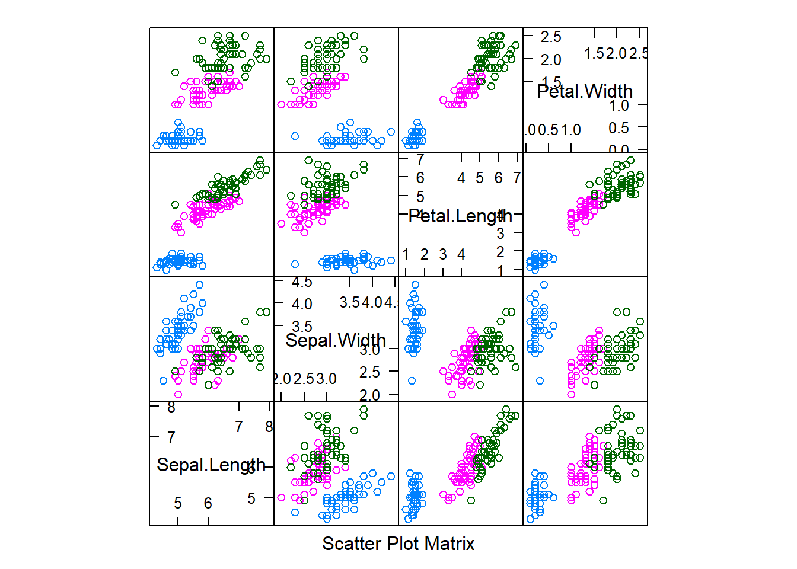
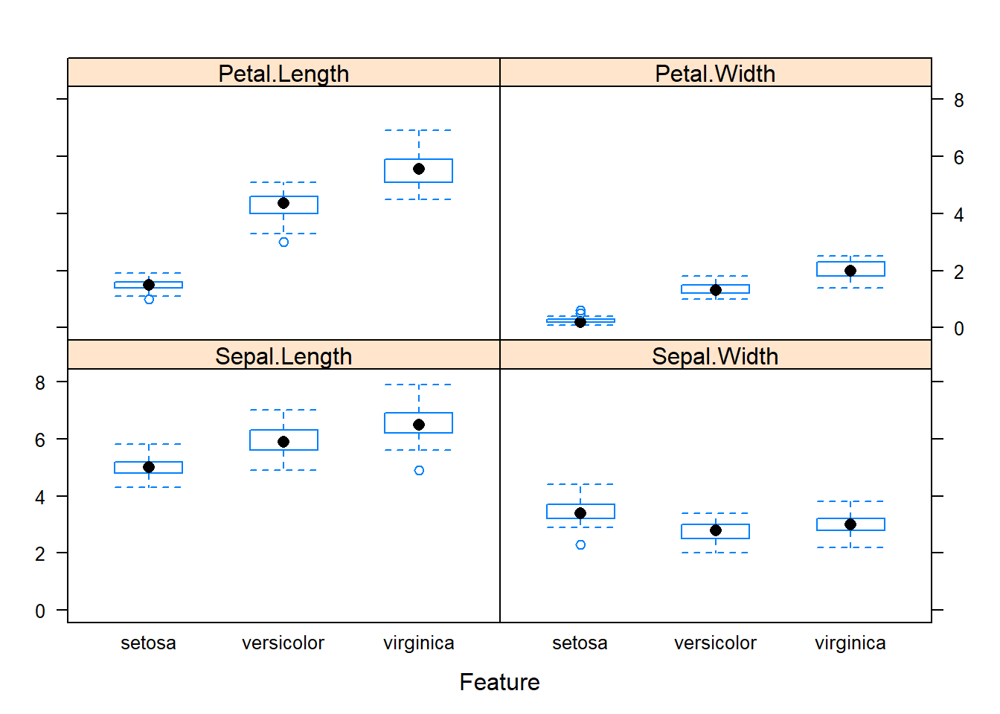
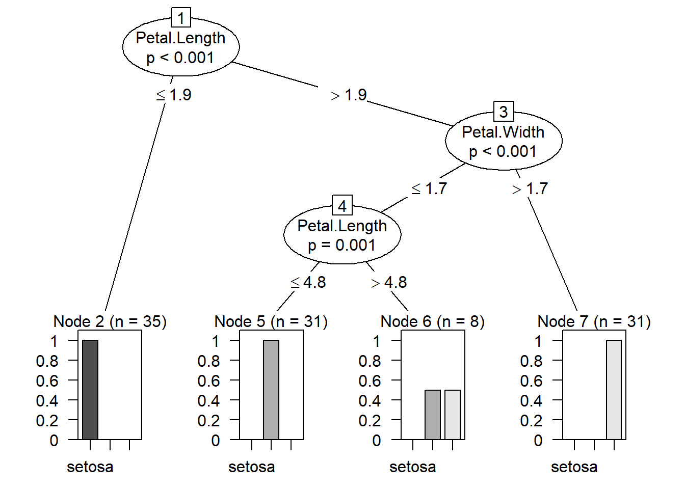

<!-- README.md is generated from README.Rmd. Please edit that file -->
Supervised Learning Project: Iris Classification
================================================

The Iris flower data set with several outcomes introduced by the British statistician and biologist Ronald Fisher in his 1936 paper. The data set consists of 50 samples from each of three species of Iris (Iris setosa, Iris virginica and Iris versicolor). Four features were measured from each sample: the length and the width of the sepals and petals, in centimeters.

Load Packages and Data
----------------------

In this section, we will load all the necessary packages for this project. Since the iris data set is already in base R and we just need to load it.

``` r
#Import necessary packages for the project
library(psych)
library(tidyverse)
library(caret)
library(rpart)
library(party)
library(randomForest)
library(class)

#Load data set
data(iris)

#First five rows on the data set
head(iris)
##   Sepal.Length Sepal.Width Petal.Length Petal.Width Species
## 1          5.1         3.5          1.4         0.2  setosa
## 2          4.9         3.0          1.4         0.2  setosa
## 3          4.7         3.2          1.3         0.2  setosa
## 4          4.6         3.1          1.5         0.2  setosa
## 5          5.0         3.6          1.4         0.2  setosa
## 6          5.4         3.9          1.7         0.4  setosa
```

Data Exploration
----------------

During this stage, we will investigate the data set even futher to have a better understanding of the data.

For this project, there is a total of four input variables and one target variable. All four input variables are numerical inputs and the target variable is a categorical data.

``` r
#To see the shape of the data
glimpse(iris)
## Observations: 150
## Variables: 5
## $ Sepal.Length <dbl> 5.1, 4.9, 4.7, 4.6, 5.0, 5.4, 4.6, 5.0, 4.4, 4.9,...
## $ Sepal.Width  <dbl> 3.5, 3.0, 3.2, 3.1, 3.6, 3.9, 3.4, 3.4, 2.9, 3.1,...
## $ Petal.Length <dbl> 1.4, 1.4, 1.3, 1.5, 1.4, 1.7, 1.4, 1.5, 1.4, 1.5,...
## $ Petal.Width  <dbl> 0.2, 0.2, 0.2, 0.2, 0.2, 0.4, 0.3, 0.2, 0.2, 0.1,...
## $ Species      <fct> setosa, setosa, setosa, setosa, setosa, setosa, s...

#Have a look at the summary statistics of input variables
describe(select(iris,-Species))
##              vars   n mean   sd median trimmed  mad min max range  skew
## Sepal.Length    1 150 5.84 0.83   5.80    5.81 1.04 4.3 7.9   3.6  0.31
## Sepal.Width     2 150 3.06 0.44   3.00    3.04 0.44 2.0 4.4   2.4  0.31
## Petal.Length    3 150 3.76 1.77   4.35    3.76 1.85 1.0 6.9   5.9 -0.27
## Petal.Width     4 150 1.20 0.76   1.30    1.18 1.04 0.1 2.5   2.4 -0.10
##              kurtosis   se
## Sepal.Length    -0.61 0.07
## Sepal.Width      0.14 0.04
## Petal.Length    -1.42 0.14
## Petal.Width     -1.36 0.06
```

From the glimpse function, we can see that there is a total of 150 observation and '-Species' is in the function is to ensure that only input variables output is seen.

### Data Visualization

Data Visualization helps us see how the target variable react with the input variables

``` r
#Scatter plot
featurePlot(x=iris[,1:4],y=iris[,5],plot="pairs")
```

 From the scatterplot, we can see that each species of the flower is grouped at the different part of the plot.

``` r
#Boxplot 
featurePlot(x=iris[,1:4],y=iris[,5],plot="box")
```

 From the boxplot,the median and range is different for each input variable. The target variable also makes it different.

Data splitting
--------------

Before training a machine learning model, it is crucial to split the data set into two groups so that we are able to test out model. The data is split into training and testing data. The training data consist of 70% of the data set.

``` r
#data split
trainIndex = createDataPartition(iris$Species,p=0.7,times=1,list=F)
training = iris[trainIndex,]
testing = iris[-trainIndex,]
```

Data Modelling
--------------

For data modelling, we will take the training data and use decision tree and random forest to create the model.

``` r
tree = ctree(Species~.,data=training)
plot(tree)
```



``` r

rf = randomForest(Species~.,data=training)
```

Model Evaluation
----------------

Once we have done the modelling, confusion matrix is used to determine the accuracy of each model. Decision tree has an accurate rate of 97% and Random Forest has an accuracy of 93%. In this case, we will use the decision tree model as they provide a higher rate of accuracy.

``` r
predict_tree = predict(tree,testing)
tree_table = table(predict_tree,testing$Species)
con_tree = confusionMatrix(tree_table)
con_tree
## Confusion Matrix and Statistics
## 
##             
## predict_tree setosa versicolor virginica
##   setosa         15          0         0
##   versicolor      0         14         1
##   virginica       0          1        14
## 
## Overall Statistics
##                                           
##                Accuracy : 0.9556          
##                  95% CI : (0.8485, 0.9946)
##     No Information Rate : 0.3333          
##     P-Value [Acc > NIR] : < 2.2e-16       
##                                           
##                   Kappa : 0.9333          
##  Mcnemar's Test P-Value : NA              
## 
## Statistics by Class:
## 
##                      Class: setosa Class: versicolor Class: virginica
## Sensitivity                 1.0000            0.9333           0.9333
## Specificity                 1.0000            0.9667           0.9667
## Pos Pred Value              1.0000            0.9333           0.9333
## Neg Pred Value              1.0000            0.9667           0.9667
## Prevalence                  0.3333            0.3333           0.3333
## Detection Rate              0.3333            0.3111           0.3111
## Detection Prevalence        0.3333            0.3333           0.3333
## Balanced Accuracy           1.0000            0.9500           0.9500

predict_rf = predict(rf,testing)
rf_table = table(predict_rf,testing$Species)
con_rf = confusionMatrix(rf_table)
con_rf
## Confusion Matrix and Statistics
## 
##             
## predict_rf   setosa versicolor virginica
##   setosa         15          0         0
##   versicolor      0         14         1
##   virginica       0          1        14
## 
## Overall Statistics
##                                           
##                Accuracy : 0.9556          
##                  95% CI : (0.8485, 0.9946)
##     No Information Rate : 0.3333          
##     P-Value [Acc > NIR] : < 2.2e-16       
##                                           
##                   Kappa : 0.9333          
##  Mcnemar's Test P-Value : NA              
## 
## Statistics by Class:
## 
##                      Class: setosa Class: versicolor Class: virginica
## Sensitivity                 1.0000            0.9333           0.9333
## Specificity                 1.0000            0.9667           0.9667
## Pos Pred Value              1.0000            0.9333           0.9333
## Neg Pred Value              1.0000            0.9667           0.9667
## Prevalence                  0.3333            0.3333           0.3333
## Detection Rate              0.3333            0.3111           0.3111
## Detection Prevalence        0.3333            0.3333           0.3333
## Balanced Accuracy           1.0000            0.9500           0.9500
```
