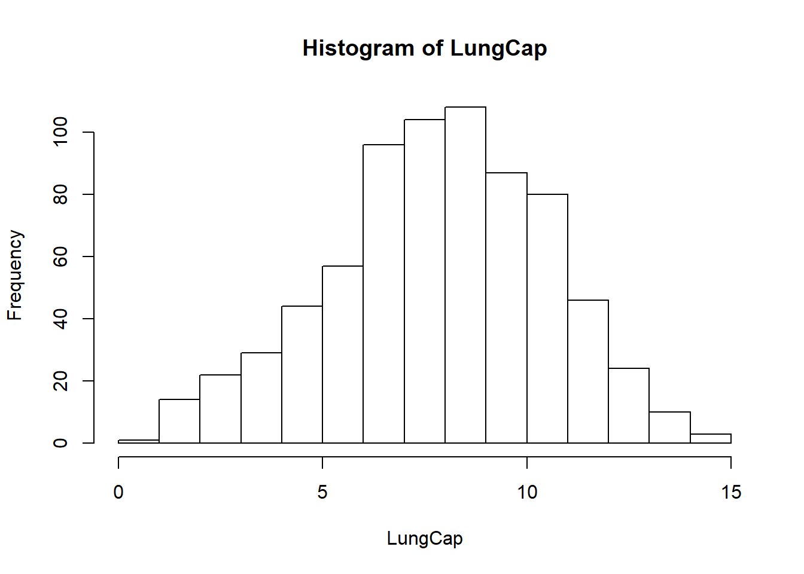
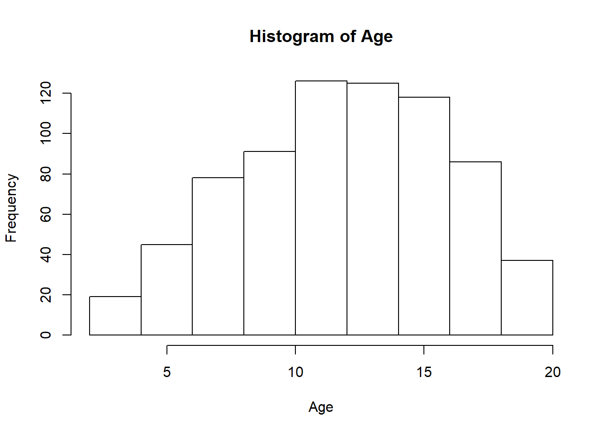
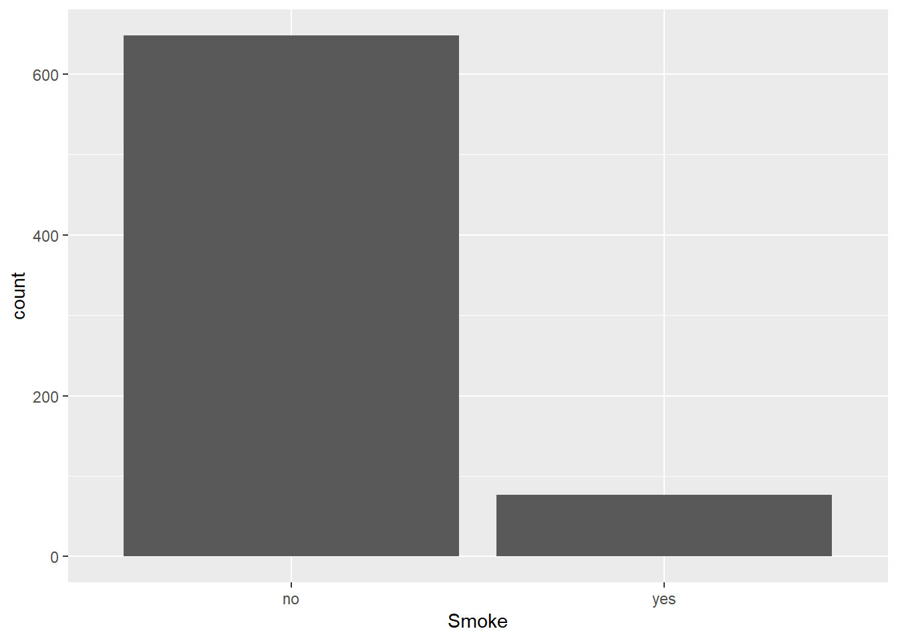
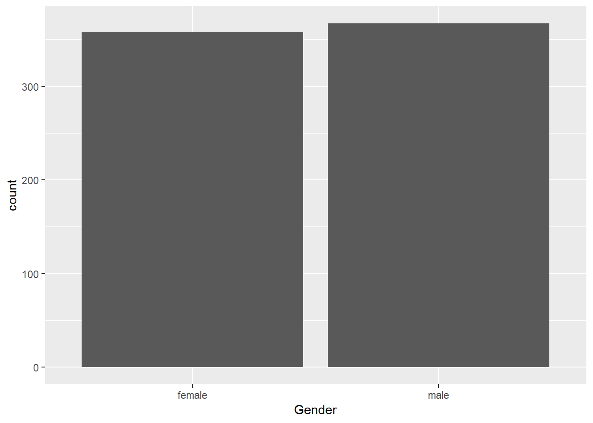
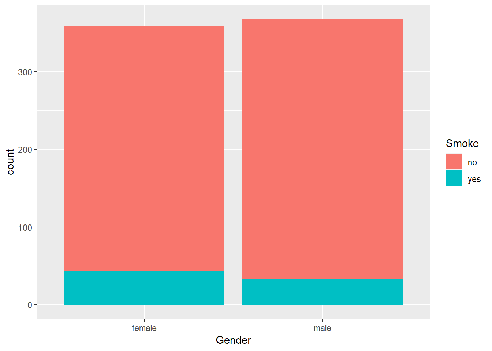
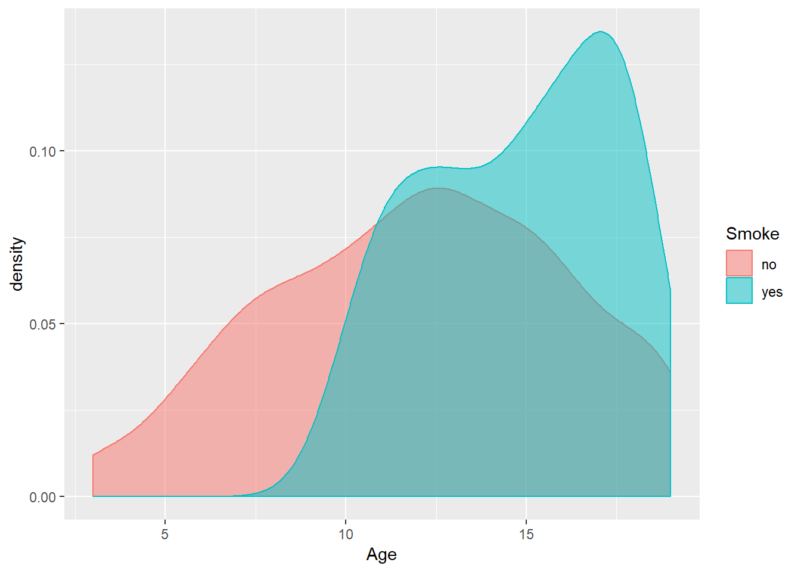
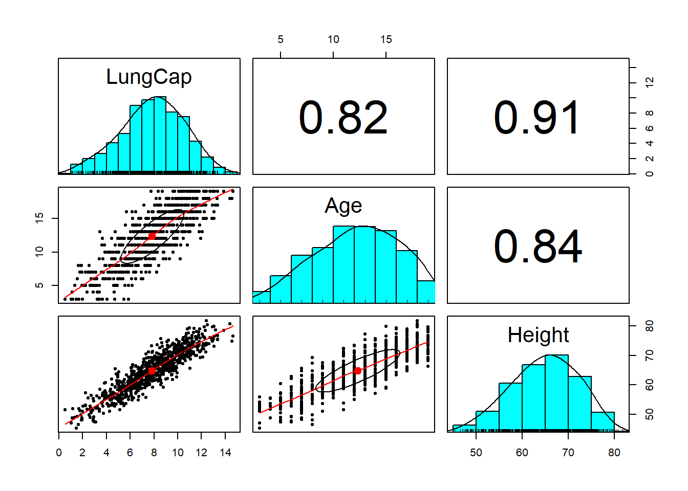
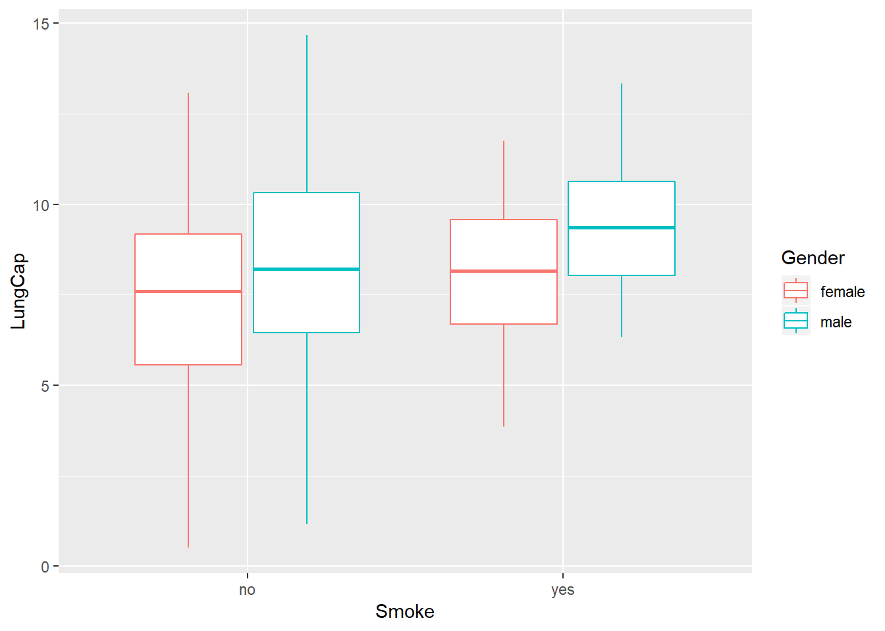

<!-- README.md is generated from README.Rmd. Please edit that file -->
Exploratory Data Analysis of Lung Capacity
==========================================

Lung Capacity data set is to measure an individual's lung capacity. The data set has a total of six variables. The following are the variables:

-   LungCap: It's the lung capacity of the person
-   Age: It's how old is the person
-   Height: How tall is the person
-   Smoke: If a person smokes or not
-   Gender: Male or female
-   Caesarean: If the person is born by caesarean

From the data set, we will try to answer the following questions:

-   Who are the people in the data set?(age,gender,smoke.etc)
-   Who are the people who are smoking?
-   What factors influences a person's lung capacity?

Load Data and Packages
----------------------

The following are the packages used for this project.

``` r
library(readxl)
library(tidyverse)
library(psych)
library(gplots)

#Load data set
df <- read_excel("~/Programming/Dataset/Excel/LungCapData.xls")

#First six rows of the data set
head(df)
## # A tibble: 6 x 6
##   LungCap   Age Height Smoke Gender Caesarean
##     <dbl> <dbl>  <dbl> <chr> <chr>  <chr>    
## 1    6.48     6   62.1 no    male   no       
## 2   10.1     18   74.7 yes   female no       
## 3    9.55    16   69.7 no    female yes      
## 4   11.1     14   71   no    male   no       
## 5    4.8      5   56.9 no    male   no       
## 6    6.22    11   58.7 no    female no
attach(df)
```

Data Exploration
----------------

In this section, we will explore the data to better understand the shape of the data. This section will also tell us the type of data for each variable to ensure we are able to use it for analysis.

``` r
#see the summary of each variable
summary(df)
##     LungCap            Age            Height         Smoke          
##  Min.   : 0.507   Min.   : 3.00   Min.   :45.30   Length:725        
##  1st Qu.: 6.150   1st Qu.: 9.00   1st Qu.:59.90   Class :character  
##  Median : 8.000   Median :13.00   Median :65.40   Mode  :character  
##  Mean   : 7.863   Mean   :12.33   Mean   :64.84                     
##  3rd Qu.: 9.800   3rd Qu.:15.00   3rd Qu.:70.30                     
##  Max.   :14.675   Max.   :19.00   Max.   :81.80                     
##     Gender           Caesarean        
##  Length:725         Length:725        
##  Class :character   Class :character  
##  Mode  :character   Mode  :character  
##                                       
##                                       
## 

#shape of the data set
glimpse(df)
## Observations: 725
## Variables: 6
## $ LungCap   <dbl> 6.475, 10.125, 9.550, 11.125, 4.800, 6.225, 4.950, 7...
## $ Age       <dbl> 6, 18, 16, 14, 5, 11, 8, 11, 15, 11, 19, 17, 12, 10,...
## $ Height    <dbl> 62.1, 74.7, 69.7, 71.0, 56.9, 58.7, 63.3, 70.4, 70.5...
## $ Smoke     <chr> "no", "yes", "no", "no", "no", "no", "no", "no", "no...
## $ Gender    <chr> "male", "female", "female", "male", "male", "female"...
## $ Caesarean <chr> "no", "no", "yes", "no", "no", "no", "yes", "no", "n...
```

We can see LungCap has a huge range and age of the observations is betwween 3 and 19 years old. We can conclude that this data set has toddlers all the way to late teens.

Data Preprocessing
------------------

From the previous section, we can see that Smoke, Gender and Caesarean all are characters. Here we will convert those variables into categorical data to ensure we are able to use them for analysis later.

``` r
df$Smoke <- as.factor(Smoke)
df$Gender <- as.factor(Gender)
df$Caesarean <- as.factor(Caesarean)
```

Data Analysis and Visualization
-------------------------------

In this section, we will look at the lungcap,age and other variables much closer to get a better understanding of the data set.

### Who Are The Participants?

``` r
hist(x=LungCap)
```



Luncap is the lung capacity for each observation. From the histogram, we can see the distribution of the Lungcap and the mean is around 7.8

``` r
hist(x=Age)
```



We can also see the distribution of the age among the participants and the mean is around 12.30.

``` r
ggplot(df,aes(x=Smoke))+
  geom_bar()
```



We can clearly see that most of the participants are non smokers.

``` r
ggplot(df,aes(x=Gender))+
  geom_bar()
```



The number of male and female participants are similar.

### Who Are The Smokers?

In this section, we will see which group are mainly smoking.

``` r
ggplot(df,aes(x=Gender,fill=Smoke))+
  geom_bar()
```



From the bar chart, we can see that the number of female smokers is slightly higher than the male smokers.

``` r
ggplot(df,aes(x=Age,col=Smoke,fill=Smoke))+
  geom_density(alpha=0.5)
```



We can clearly see that the smokers are mainly from an older age group. This is quite understandable since most young people do not start smoking until they are teenageers.

What Factors Someone's Lung Capacity?
=====================================

In this section, we are going to see which variable has a relationship with lung capacity.

``` r
pairs.panels(df[1:3])
```



From the pair panels, it is clear that both age and height has a positive correlation with lung capacity.

``` r
ggplot(df,aes(x=Smoke,y=LungCap,col=Gender))+
  geom_boxplot()
```



Is it clear from the boxplot that male has a higher rate of lung capacity. Although it is shown that smokers do have slightly higher lung capacity, we can conclude that this is because most smokers are older than non smokers.
