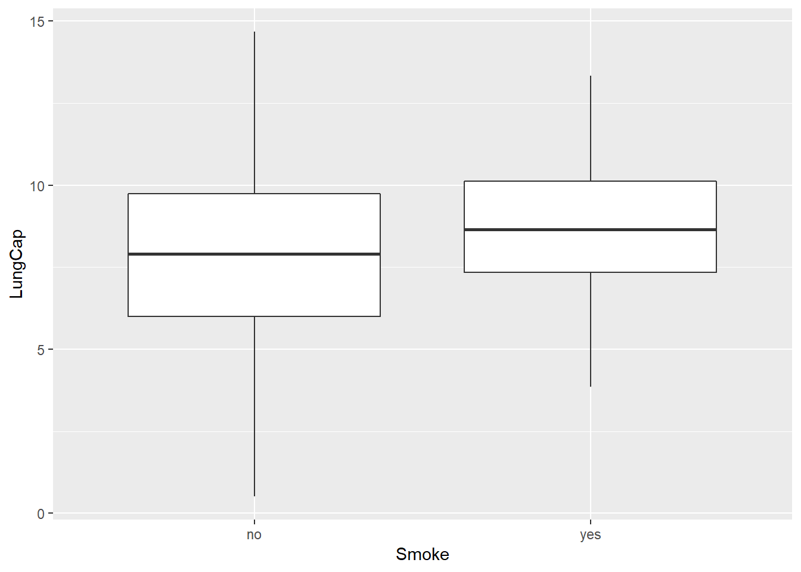

<!-- README.md is generated from README.Rmd. Please edit that file -->
Analysis of Lung Capcity
========================

by Asyraff latiffi
------------------

**Part 1**

    ##     LungCap            Age            Height      Smoke        Gender   
    ##  Min.   : 0.507   Min.   : 3.00   Min.   :45.30   no :648   female:358  
    ##  1st Qu.: 6.150   1st Qu.: 9.00   1st Qu.:59.90   yes: 77   male  :367  
    ##  Median : 8.000   Median :13.00   Median :65.40                         
    ##  Mean   : 7.863   Mean   :12.33   Mean   :64.84                         
    ##  3rd Qu.: 9.800   3rd Qu.:15.00   3rd Qu.:70.30                         
    ##  Max.   :14.675   Max.   :19.00   Max.   :81.80                         
    ##  Caesarean
    ##  no :561  
    ##  yes:164  
    ##           
    ##           
    ##           
    ## 

**Part 2** 

The mean Lung Capacity for men was 8.3093324.
